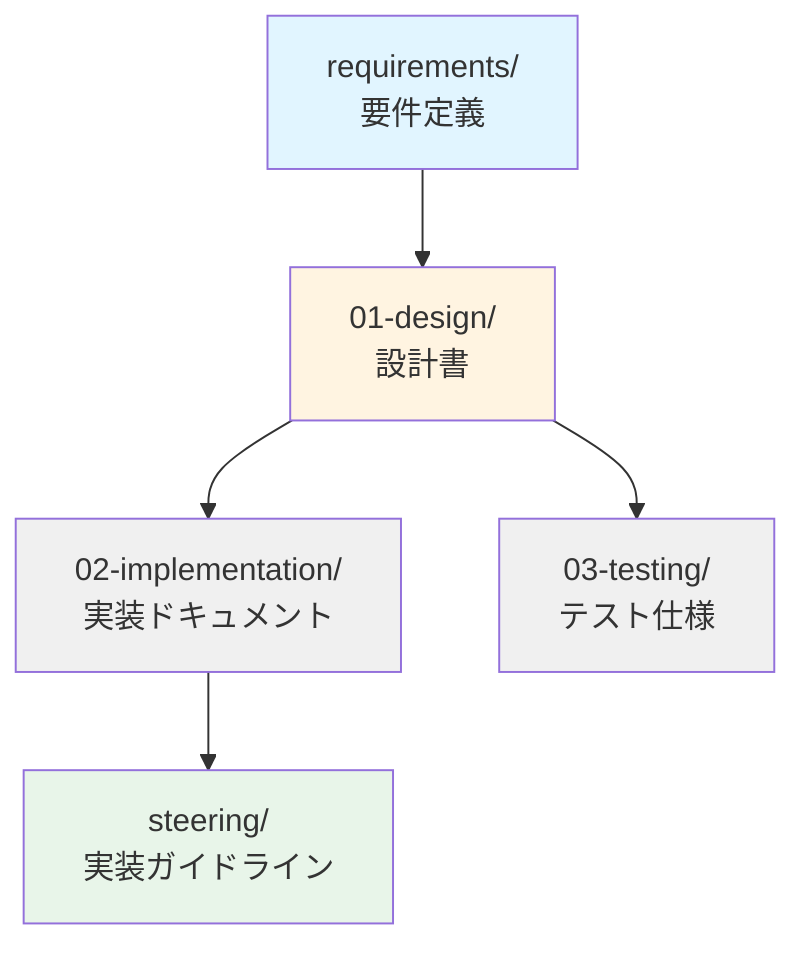

# TDnet Data Collector - プロジェクト概要

**バージョン:** 1.0.0  
**最終更新:** 2026-02-22

---

## Introduction

TDnet Data Collectorは、日本取引所グループが提供するTDnet（適時開示情報閲覧サービス）から上場企業の開示情報を自動収集するシステムです。個人投資家がコストを抑えながら、投資判断とデータ分析のために開示情報を効率的に収集・管理できることを目的としています。

## 用語集

- **TDnet**: 日本取引所グループが提供する適時開示情報閲覧サービス
- **システム**: TDnet Data Collectorシステム
- **開示情報**: 上場企業が公開する適時開示情報（決算短信、業績予想、IR資料など）
- **メタデータ**: 開示情報の属性情報（企業コード、開示日時、開示種類、タイトルなど）
- **バッチ収集**: 定期的に自動実行されるデータ収集処理
- **オンデマンド収集**: ユーザーが任意のタイミングで実行するデータ収集処理
- **ストレージ層**: データを永続化する層（データベースとファイルストレージの具体的な技術は設計フェーズで決定）
- **AWSインフラストラクチャ**: システムはAmazon Web Services上で構築・運用される

## ドキュメント構造

### 要件定義（このフォルダ）

- **[overview.md](./overview.md)** - プロジェクト概要、用語集、ドキュメント構造（このファイル）
- **[functional-requirements.md](./functional-requirements.md)** - 機能要件（要件1-11）
- **[non-functional-requirements.md](./non-functional-requirements.md)** - 非機能要件（要件12-15）
- **[requirements-mapping.md](./requirements-mapping.md)** - 要件とドキュメントの対応表

### 設計・実装

- **[設計書](../01-design/design.md)** - 本要件定義を基にした詳細設計
- **[OpenAPI仕様](../01-design/openapi.yaml)** - REST API仕様
- **[データベーススキーマ](../01-design/database-schema.md)** - DynamoDBテーブル設計
- **[API設計](../01-design/api-design.md)** - APIエンドポイント設計

### 実装ガイドライン（Steering）

プロジェクトルートの `.kiro/steering/` フォルダに実装ガイドラインがあります：

#### コア実装ルール
- **[実装ルール](../../../steering/core/tdnet-implementation-rules.md)** - 基本的なコーディング規約とベストプラクティス
- **[エラーハンドリング](../../../steering/core/error-handling-patterns.md)** - エラー処理パターン
- **[タスク実行ルール](../../../steering/core/tdnet-data-collector.md)** - タスク管理とフィードバックループ

#### 開発ガイドライン
- **[テスト戦略](../../../steering/development/testing-strategy.md)** - テスト実装のベストプラクティス
- **[データバリデーション](../../../steering/development/data-validation.md)** - バリデーションルール
- **[スクレイピングパターン](../../../steering/development/tdnet-scraping-patterns.md)** - TDnetスクレイピングの実装

#### インフラ・運用
- **[デプロイチェックリスト](../../../steering/infrastructure/deployment-checklist.md)** - デプロイ前後の確認項目
- **[環境変数管理](../../../steering/infrastructure/environment-variables.md)** - 環境変数の定義と管理
- **[パフォーマンス最適化](../../../steering/infrastructure/performance-optimization.md)** - 最適化戦略
- **[監視とアラート](../../../steering/infrastructure/monitoring-alerts.md)** - 監視設定

#### セキュリティ・API
- **[セキュリティベストプラクティス](../../../steering/security/security-best-practices.md)** - セキュリティガイドライン
- **[API設計ガイドライン](../../../steering/api/api-design-guidelines.md)** - RESTful API設計

## ドキュメント依存関係

---

**最終更新:** 2026-02-22
