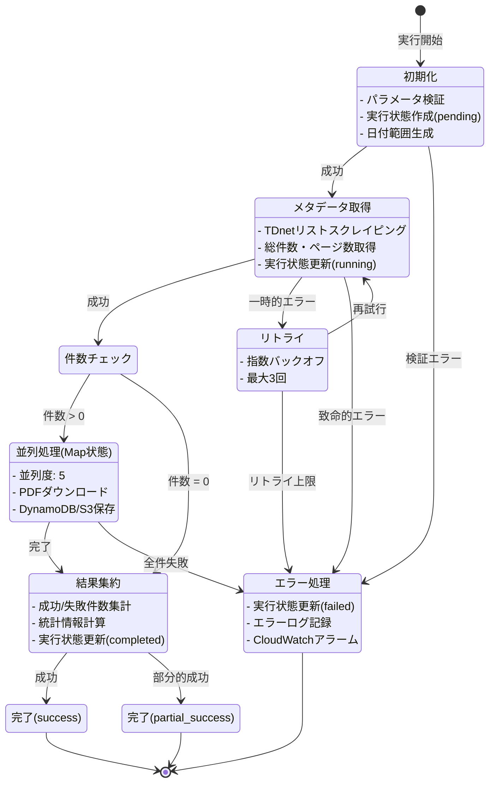
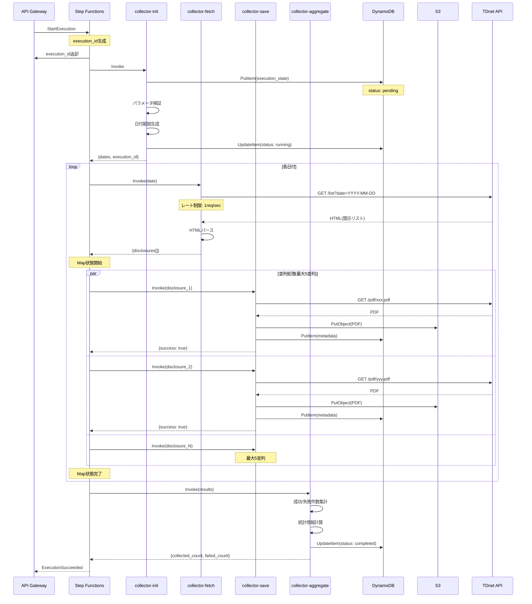
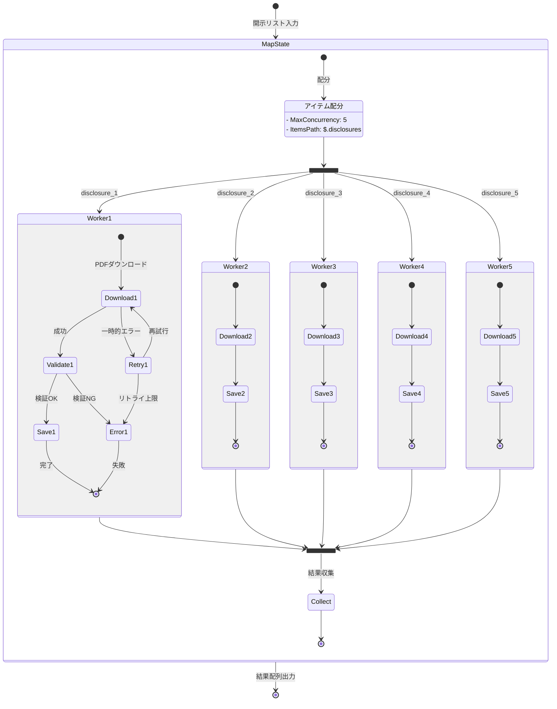
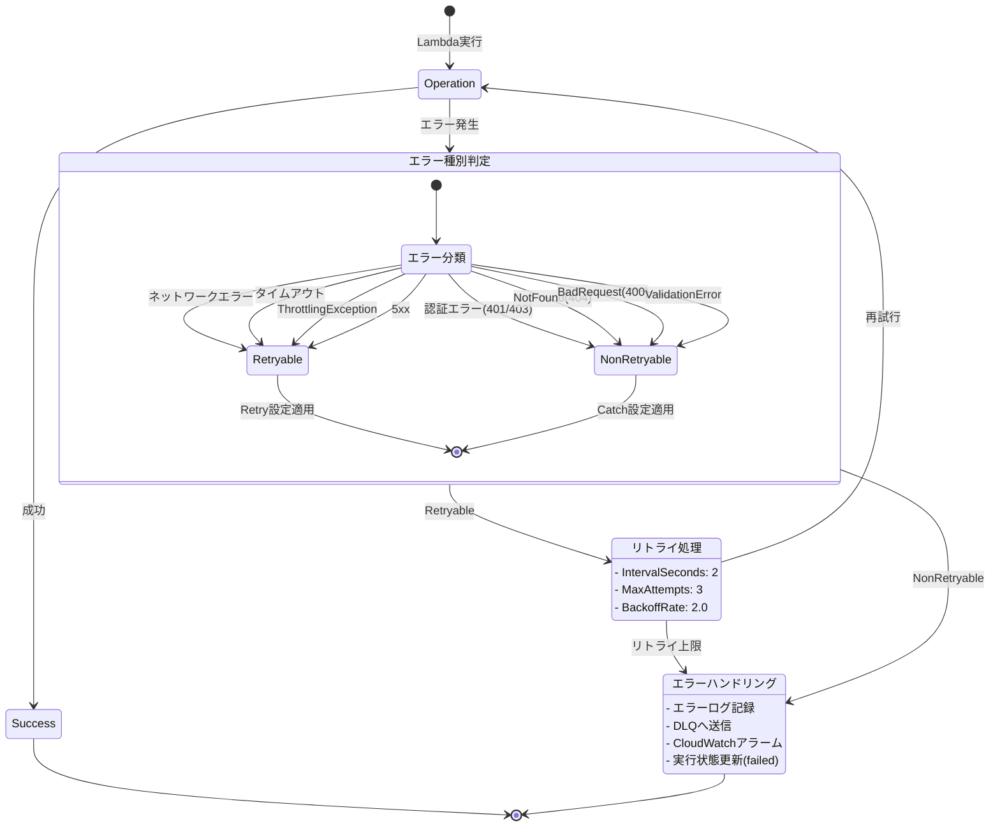

# Step Functionsワークフロー図

**作成日**: 2026-02-22
**バージョン**: 1.0
**関連タスク**: tasks-step-functions-migration.md タスク1.1

## 概要

TDnetデータ収集処理をAWS Step Functionsでオーケストレーションするためのワークフロー設計。Standard Workflowsを使用し、長時間実行、可視性、エラーハンドリング、並列処理の最適化を実現。

## 1. 状態遷移図（全体フロー）



## 2. シーケンス図（Lambda関数間の連携）




## 3. 並列処理図（Map状態の詳細）



## 4. エラーハンドリングフロー



## 5. 状態定義（Amazon States Language）

### 5.1 Initialize State

```json
{
  "Initialize": {
    "Type": "Task",
    "Resource": "arn:aws:lambda:REGION:ACCOUNT:function:collector-init",
    "TimeoutSeconds": 60,
    "Retry": [
      {
        "ErrorEquals": ["States.TaskFailed"],
        "IntervalSeconds": 2,
        "MaxAttempts": 3,
        "BackoffRate": 2.0
      }
    ],
    "Catch": [
      {
        "ErrorEquals": ["ValidationError"],
        "ResultPath": "$.error",
        "Next": "HandleValidationError"
      },
      {
        "ErrorEquals": ["States.ALL"],
        "ResultPath": "$.error",
        "Next": "HandleError"
      }
    ],
    "Next": "FetchMetadata"
  }
}
```

### 5.2 FetchMetadata State

```json
{
  "FetchMetadata": {
    "Type": "Task",
    "Resource": "arn:aws:lambda:REGION:ACCOUNT:function:collector-fetch",
    "TimeoutSeconds": 300,
    "Retry": [
      {
        "ErrorEquals": ["NetworkError", "TimeoutError"],
        "IntervalSeconds": 2,
        "MaxAttempts": 3,
        "BackoffRate": 2.0
      }
    ],
    "Catch": [
      {
        "ErrorEquals": ["States.ALL"],
        "ResultPath": "$.error",
        "Next": "HandleError"
      }
    ],
    "Next": "CheckEmpty"
  }
}
```

### 5.3 ProcessDisclosures State (Map)

```json
{
  "ProcessDisclosures": {
    "Type": "Map",
    "ItemsPath": "$.disclosures",
    "MaxConcurrency": 5,
    "Iterator": {
      "StartAt": "SaveDisclosure",
      "States": {
        "SaveDisclosure": {
          "Type": "Task",
          "Resource": "arn:aws:lambda:REGION:ACCOUNT:function:collector-save",
          "TimeoutSeconds": 120,
          "Retry": [
            {
              "ErrorEquals": ["NetworkError", "S3Error"],
              "IntervalSeconds": 2,
              "MaxAttempts": 3,
              "BackoffRate": 2.0
            }
          ],
          "Catch": [
            {
              "ErrorEquals": ["States.ALL"],
              "ResultPath": "$.error",
              "Next": "LogError"
            }
          ],
          "End": true
        },
        "LogError": {
          "Type": "Pass",
          "Result": {"success": false},
          "End": true
        }
      }
    },
    "ResultPath": "$.results",
    "Next": "Aggregate"
  }
}
```

### 5.4 Aggregate State

```json
{
  "Aggregate": {
    "Type": "Task",
    "Resource": "arn:aws:lambda:REGION:ACCOUNT:function:collector-aggregate",
    "TimeoutSeconds": 60,
    "Retry": [
      {
        "ErrorEquals": ["States.TaskFailed"],
        "IntervalSeconds": 2,
        "MaxAttempts": 3,
        "BackoffRate": 2.0
      }
    ],
    "Next": "CheckStatus"
  }
}
```

## 6. タイムアウト設定

| State | タイムアウト | 理由 |
|-------|------------|------|
| Initialize | 60秒 | パラメータ検証、DynamoDB書き込み |
| FetchMetadata | 300秒 | TDnet APIスクレイピング（最大5分） |
| SaveDisclosure | 120秒 | PDFダウンロード、S3/DynamoDB書き込み |
| Aggregate | 60秒 | 結果集約、統計計算 |
| 全体 | 1時間 | 大量データ収集時の余裕を持たせる |

## 7. 並列実行制御

### 7.1 Map状態のMaxConcurrency

- **設定値**: 5
- **理由**:
  - TDnet APIのレート制限（1リクエスト/秒）を考慮
  - Lambda同時実行数の制限（アカウント全体で1000）
  - コスト最適化（無料枠内での運用）

### 7.2 レート制限の実装

```typescript
// collector-save Lambda内でレート制限を実装
import { RateLimiter } from '../../utils/rate-limiter';

const rateLimiter = new RateLimiter(1, 1000); // 1リクエスト/秒

export async function handler(event: SaveEvent) {
  await rateLimiter.acquire();
  // PDFダウンロード処理
}
```

## 8. 進捗追跡

### 8.1 DynamoDB実行状態テーブル

```typescript
interface ExecutionState {
  execution_id: string;           // PK
  status: 'pending' | 'running' | 'completed' | 'failed';
  start_time: string;             // ISO 8601
  end_time?: string;              // ISO 8601
  progress: number;               // 0-100
  collected_count: number;
  failed_count: number;
  total_count: number;
  error_message?: string;
  ttl: number;                    // 30日後削除
}
```

### 8.2 進捗更新タイミング

1. **Initialize**: status = 'pending', progress = 0
2. **FetchMetadata**: status = 'running', total_count設定
3. **Map状態（各バッチ完了時）**: progress更新、collected_count/failed_count更新
4. **Aggregate**: status = 'completed'/'failed', progress = 100

## 9. コスト試算

### 9.1 Step Functions料金

- **Standard Workflows**: $25/100万状態遷移
- **1回の実行**: 約10-20状態遷移
  - Initialize: 1
  - FetchMetadata: 1-5（日付数）
  - Map状態: 1
  - SaveDisclosure: N（開示件数、ただしMap内部なので課金対象外）
  - Aggregate: 1
  - エラーハンドリング: 0-3
- **月間200回実行**: 2,000-4,000状態遷移 = **無料枠内（4,000/月）**

### 9.2 Lambda料金

- **collector-init**: 128MB, 5秒, 200回/月 = 無料枠内
- **collector-fetch**: 256MB, 30秒, 1,000回/月 = 無料枠内
- **collector-save**: 512MB, 10秒, 100,000回/月 = 無料枠内
- **collector-aggregate**: 128MB, 5秒, 200回/月 = 無料枠内

**合計**: 無料枠内で運用可能

## 10. 実装優先順位

### フェーズ1: 基本フロー（高優先度）
1. Initialize State
2. FetchMetadata State
3. Map State (SaveDisclosure)
4. Aggregate State

### フェーズ2: エラーハンドリング（高優先度）
1. Retry設定
2. Catch設定
3. DLQ連携
4. CloudWatchアラーム

### フェーズ3: 最適化（中優先度）
1. 並列度調整
2. タイムアウト調整
3. 進捗追跡の詳細化

## 11. 関連ドキュメント

- `tasks-step-functions-migration.md` - 移行タスク一覧
- `step-functions-architecture.md` - アーキテクチャ設計（作成予定）
- `step-functions-cost-analysis.md` - コスト分析（作成予定）
- `../../core/tdnet-implementation-rules.md` - 実装ルール
- `../../core/error-handling-patterns.md` - エラーハンドリング

## 12. 次のステップ

1. Lambda関数の分割設計（タスク1.1）
2. DynamoDB実行状態管理設計（タスク1.1）
3. ステートマシン定義の詳細化（タスク1.2）
4. Lambda関数の実装（フェーズ2）
