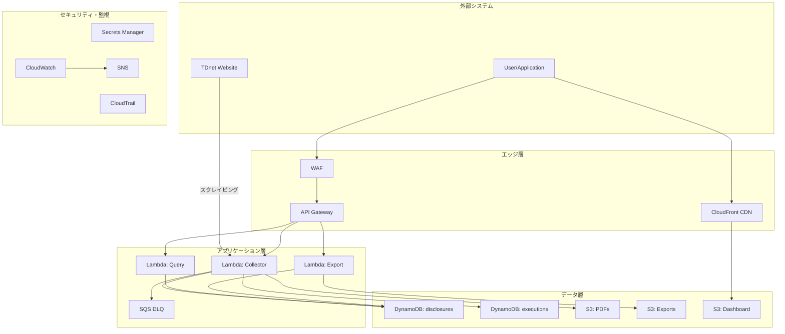

# TDnet Data Collector - アーキテクチャ設計書

## システム概要

TDnet Data Collectorは、TDnet（適時開示情報伝達システム）から上場企業の開示情報を自動収集し、APIで提供するAWSサーバーレスシステムです。

## アーキテクチャ原則

1. **サーバーレス**: Lambda、DynamoDB、S3を中心とした完全サーバーレス構成
2. **コスト最適化**: AWS無料枠内での運用を目指す
3. **スケーラビリティ**: オンデマンドスケーリングによる柔軟な拡張性
4. **セキュリティ**: 最小権限の原則、暗号化、監査ログ
5. **可観測性**: CloudWatch Logs、Metrics、Alarms、Dashboardによる包括的な監視

## スタック分割設計

単一の巨大なスタックを4つの独立したスタックに分割し、デプロイ時間の短縮とロールバックの影響範囲を最小化します。

### スタック構成

```
1. TdnetFoundation-{env} (基盤層)
   ├─ DynamoDB Tables (3つ)
   │  ├─ tdnet_disclosures
   │  ├─ tdnet_executions
   │  └─ tdnet_export_status
   ├─ S3 Buckets (4つ)
   │  ├─ PDFs
   │  ├─ Exports
   │  ├─ Dashboard
   │  └─ CloudTrail Logs
   ├─ Secrets Manager
   └─ SNS Topic (Alerts)

2. TdnetCompute-{env} (コンピュート層)
   ├─ Lambda Functions (7つ)
   │  ├─ Collector
   │  ├─ Query
   │  ├─ Export
   │  ├─ Collect
   │  ├─ Collect Status
   │  ├─ Export Status
   │  └─ PDF Download
   └─ DLQ (Dead Letter Queue)

3. TdnetApi-{env} (API層)
   ├─ API Gateway
   ├─ API Key & Usage Plan
   ├─ WAF Web ACL
   └─ CloudFront Distribution

4. TdnetMonitoring-{env} (監視層)
   ├─ CloudWatch Alarms
   ├─ CloudWatch Dashboard
   └─ CloudTrail
```

### 依存関係

```
Foundation (基盤)
    ↓
Compute (Lambda関数)
    ↓
API (API Gateway)
    ↓
Monitoring (監視)
```

### 分割の利点

| スタック | 推定デプロイ時間 | 変更頻度 |
|---------|----------------|---------|
| Foundation | 5-7分 | 低（月1回以下） |
| Compute | 3-5分 | 高（週数回） |
| API | 2-3分 | 中（月数回） |
| Monitoring | 2-3分 | 低（月1回以下） |

**従来**: 全体で15-20分  
**分割後**: 変更のあるスタックのみ（通常3-5分）

### デプロイ方法

```powershell
# 全スタックデプロイ
.\scripts\deploy-split-stacks.ps1 -Environment dev -Action deploy -Stack all

# 個別スタックデプロイ
.\scripts\deploy-split-stacks.ps1 -Environment dev -Action deploy -Stack compute

# 差分確認
.\scripts\deploy-split-stacks.ps1 -Environment dev -Action diff -Stack all
```

## Lambda Collectorアーキテクチャ

### 概要

Lambda Collectorは、TDnetから開示情報を自動収集するサーバーレス関数です。

**主要機能:**
- バッチモード: 前日の開示情報を自動収集（日次実行）
- オンデマンドモード: 指定期間の開示情報を手動収集
- 並列処理: 複数の開示情報を並行してダウンロード・保存
- 部分的失敗の許容: 一部の開示情報が失敗しても処理を継続

**技術スタック:**
- ランタイム: Node.js 20.x
- 言語: TypeScript
- メモリ: 512MB
- タイムアウト: 15分
- 並列度: 5（同時ダウンロード数）

### システム全体図

```
┌─────────────────────────────────────────────────────────────────┐
│                        Lambda Collector                          │
│                                                                   │
│  ┌──────────────┐                                                │
│  │   Handler    │ ← Event (batch/on-demand)                      │
│  └──────┬───────┘                                                │
│         │                                                         │
│         ├─→ Validate Event                                       │
│         │                                                         │
│         ├─→ Update Execution Status (pending → running)          │
│         │                                                         │
│         ├─→ Generate Date Range                                  │
│         │                                                         │
│         └─→ For each date:                                       │
│             ┌────────────────────────────────────────┐           │
│             │  1. Scrape TDnet List                  │           │
│             │     ↓                                   │           │
│             │  2. Process Disclosures (parallel)     │           │
│             │     ├─→ Generate Disclosure ID         │           │
│             │     ├─→ Download PDF → S3              │           │
│             │     └─→ Save Metadata → DynamoDB       │           │
│             │     ↓                                   │           │
│             │  3. Update Progress                    │           │
│             └────────────────────────────────────────┘           │
│                                                                   │
│         └─→ Update Execution Status (completed/failed)           │
│                                                                   │
└─────────────────────────────────────────────────────────────────┘
         │                    │                    │
         ↓                    ↓                    ↓
    ┌────────┐          ┌─────────┐         ┌──────────┐
    │ TDnet  │          │   S3    │         │ DynamoDB │
    │  Web   │          │ Bucket  │         │  Tables  │
    └────────┘          └─────────┘         └──────────┘
```

### コンポーネント構成

```
src/lambda/collector/
│
├── handler.ts                    # メインハンドラー
│   ├── handler()                 # Lambda エントリーポイント
│   ├── validateEvent()           # イベントバリデーション
│   ├── handleBatchMode()         # バッチモード処理
│   ├── handleOnDemandMode()      # オンデマンドモード処理
│   └── collectDisclosuresForDateRange()  # 日付範囲処理
│
├── scrape-tdnet-list.ts          # TDnetスクレイピング
│   └── scrapeTdnetList()         # 開示情報リスト取得
│
├── download-pdf.ts               # PDFダウンロード
│   └── downloadPdf()             # PDF取得 → S3保存
│
├── save-metadata.ts              # メタデータ保存
│   └── saveMetadata()            # DynamoDB保存
│
└── update-execution-status.ts    # 実行状態管理
    ├── updateExecutionStatus()   # 状態更新
    └── getExecutionStatus()      # 状態取得
```

### 主要コンポーネント

**1. Handler（handler.ts）**
- Lambda関数のメインエントリーポイント
- イベント処理、モード判定、エラーハンドリング

**2. Scrape TDnet List（scrape-tdnet-list.ts）**
- TDnet Webサイトから指定日の開示情報リストを取得
- HTMLパース、メタデータ抽出、バリデーション

**3. Download PDF（download-pdf.ts）**
- PDFファイルをダウンロードしてS3に保存
- ストリーム処理、S3キー生成

**4. Save Metadata（save-metadata.ts）**
- 開示情報メタデータをDynamoDBに保存
- date_partition生成、重複チェック

**5. Update Execution Status（update-execution-status.ts）**
- Lambda実行状態をDynamoDBに保存・更新
- 進捗率計算、TTL設定

### パフォーマンス特性

| 項目 | 目標値 | 実測値（参考） |
|------|--------|---------------|
| 1日分の収集（50件） | < 2分 | 約1分30秒 |
| 1週間分の収集（350件） | < 10分 | 約8分 |
| 1ヶ月分の収集（1500件） | < 15分 | 約12分 |
| メモリ使用量 | 512MB | 約300MB（ピーク時） |

## システム構成図



## コンポーネント一覧

### Lambda関数

| 関数名 | 責務 | タイムアウト | メモリ |
|--------|------|------------|--------|
| Collector | データ収集、スクレイピング | 15分 | 512MB |
| Query | データクエリ、検索 | 30秒 | 256MB |
| Export | データエクスポート | 5分 | 512MB |
| Collect | 収集トリガー | 30秒 | 256MB |
| Collect Status | 収集状態取得 | 30秒 | 256MB |
| Export Status | エクスポート状態取得 | 30秒 | 256MB |
| PDF Download | PDF署名付きURL生成 | 30秒 | 256MB |
| Health | ヘルスチェック | 30秒 | 256MB |
| Stats | 統計情報 | 30秒 | 256MB |

### DynamoDBテーブル

| テーブル名 | パーティションキー | GSI | 用途 |
|-----------|------------------|-----|------|
| tdnet_disclosures | disclosure_id | date_partition + disclosed_at | 開示情報メタデータ |
| tdnet_executions | execution_id | status + started_at | 実行状態管理 |

### S3バケット

| バケット名 | 用途 | ライフサイクル |
|-----------|------|--------------|
| tdnet-pdfs-{account-id} | PDFファイル保存 | 90日後Standard-IA、365日後Glacier |
| tdnet-exports-{account-id} | エクスポートファイル | 7日後削除 |
| tdnet-dashboard-{account-id} | 静的Webサイト | - |
| tdnet-cloudtrail-logs-{account-id} | 監査ログ | 90日後Glacier、7年後削除 |

## セキュリティ設計

### IAM設計

**原則**: 最小権限の原則（Principle of Least Privilege）

**Lambda実行ロール:**
- DynamoDB: 特定テーブルへの読み書き権限のみ
- S3: 特定バケットへのアクセス権限のみ
- CloudWatch Logs: ログ書き込み権限
- Secrets Manager: APIキー読み取り権限（CDKデプロイ時のみ）

### 暗号化

| リソース | 暗号化方式 | 説明 |
|---------|-----------|------|
| DynamoDB | AWS管理キー | 保管時暗号化 |
| S3 | SSE-S3 | 保管時暗号化 |
| Secrets Manager | AWS管理キー | APIキー暗号化 |
| CloudWatch Logs | AWS管理キー | ログ暗号化 |

### WAF設定

**ルール:**
- レート制限: 2000リクエスト/IP/5分
- AWSマネージドルール: Common Rule Set
- 地理的制限: 日本からのアクセスのみ許可（オプション）

**詳細**: `../../steering/security/security-best-practices.md`

## CloudWatch設定

### ログ保持期間

| ログ種別 | 本番環境 | 開発環境 |
|---------|---------|---------|
| Lambda Collector | 3ヶ月 | 1週間 |
| Lambda Query/Export | 1ヶ月 | 1週間 |

### カスタムメトリクス

- DisclosuresCollected: 日次収集件数
- DisclosuresFailed: 失敗件数
- CollectionSuccessRate: 成功率（%）

### アラーム

- Lambda Error Rate > 10%: Critical
- Lambda Duration > 14分: Warning
- DLQ Messages > 0: Critical
- CollectionSuccessRate < 95%: Warning

**詳細**: `../../steering/infrastructure/monitoring-alerts.md`

## ネットワーク設計

### VPC不使用

**理由:**
- Lambda関数はVPC外で実行（パブリックサブネット不要）
- DynamoDB、S3はVPCエンドポイント不要（パブリックエンドポイント使用）
- コスト削減（NATゲートウェイ不要）
- シンプルな構成

### API Gateway設定

- **エンドポイントタイプ**: Regional
- **認証**: APIキー認証（使用量プラン）
- **レート制限**: 50リクエスト/秒、バースト100
- **CORS**: 有効（ダッシュボード用）

## デプロイ戦略

### 環境分離

- **開発環境（dev）**: 短いタイムアウト、少ないメモリ、DEBUGログレベル
- **本番環境（prod）**: 長いタイムアウト、多いメモリ、INFOログレベル

### CI/CD

- **GitHub Actions**: テスト、ビルド、デプロイ
- **CDK**: インフラストラクチャコード管理
- **ブルーグリーンデプロイ**: CodeDeployで段階的デプロイ

**詳細**: `../../steering/infrastructure/deployment-checklist.md`

## スケーラビリティ

### Lambda

- **同時実行数**: Reserved Concurrency = 1（Collector）、他は無制限
- **オートスケーリング**: 自動（AWS管理）

### DynamoDB

- **課金モード**: オンデマンド
- **オートスケーリング**: 自動（AWS管理）

### S3

- **スケーラビリティ**: 無制限（AWS管理）

## 可用性

### 目標

- **稼働率**: 99.9%（月間ダウンタイム43分以内）
- **RTO（目標復旧時間）**: 1時間
- **RPO（目標復旧時点）**: 24時間

### 高可用性設計

- **マルチAZ**: DynamoDB、S3は自動的にマルチAZ
- **Lambda**: 複数AZで自動実行
- **API Gateway**: マルチAZ構成

### バックアップ

- **DynamoDB**: Point-in-Time Recovery（PITR）有効
- **S3**: バージョニング有効
- **CloudTrail**: 7年間保持

## パフォーマンス

### 目標値

| メトリクス | 目標値 |
|-----------|--------|
| API応答時間（P95） | 500ms以内 |
| データ収集時間（50件） | 5分以内 |
| エクスポート時間（1,000件） | 30秒以内 |

**詳細**: `../../steering/infrastructure/performance-optimization.md`

## コスト見積もり

**月間コスト（個人利用想定）:**
- Lambda: $0.00（無料枠内）
- DynamoDB: $0.25
- S3: $0.34
- API Gateway + CloudFront: $0.16
- CloudWatch: $7.50
- WAF + Secrets Manager + CloudTrail: $7.42
- **合計**: $15.67/月

**詳細**: `design.md`のコスト見積もりセクション

## 関連ドキュメント

### 設計ドキュメント
- **[Design Document](./design.md)** - システム全体設計
- **[Requirements](./requirements.md)** - 要件定義
- **[API Design](./api-design.md)** - API設計

### 実装ガイドライン（Steering）
- **[実装ルール](../../steering/core/tdnet-implementation-rules.md)** - 技術スタック、実装原則
- **[セキュリティベストプラクティス](../../steering/security/security-best-practices.md)** - IAM、暗号化、WAF
- **[パフォーマンス最適化](../../steering/infrastructure/performance-optimization.md)** - Lambda最適化、コスト削減
- **[監視とアラート](../../steering/infrastructure/monitoring-alerts.md)** - CloudWatch設定
- **[デプロイチェックリスト](../../steering/infrastructure/deployment-checklist.md)** - デプロイ手順

---

**最終更新:** 2026-02-15
