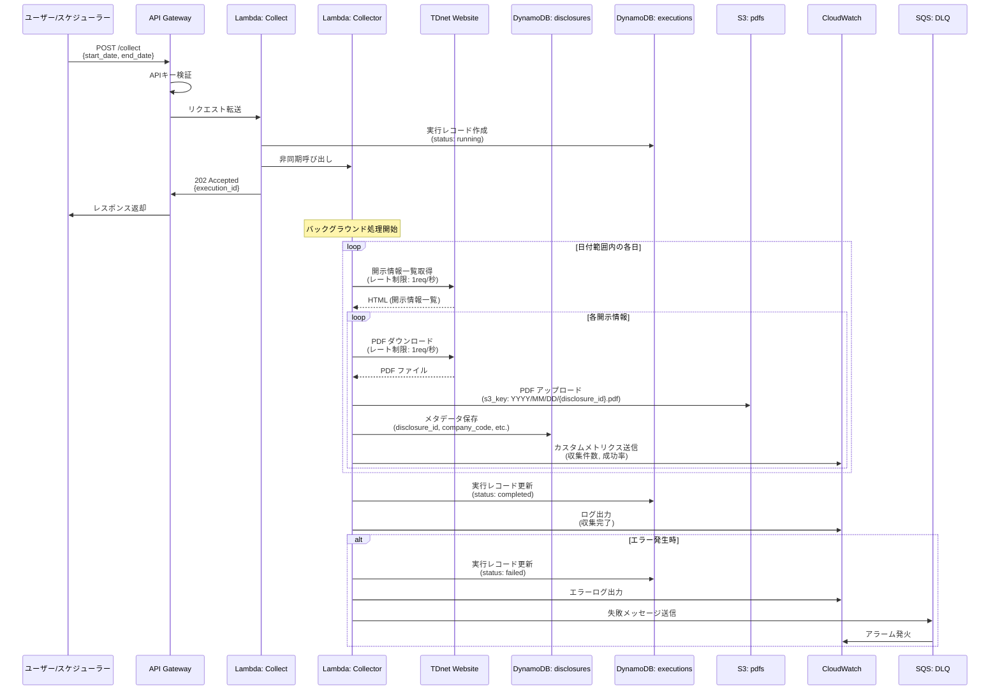
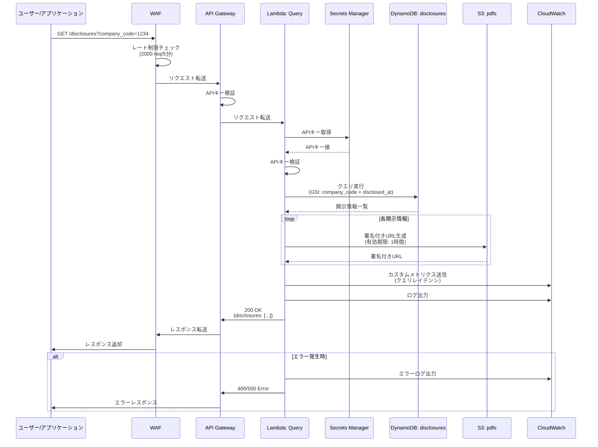
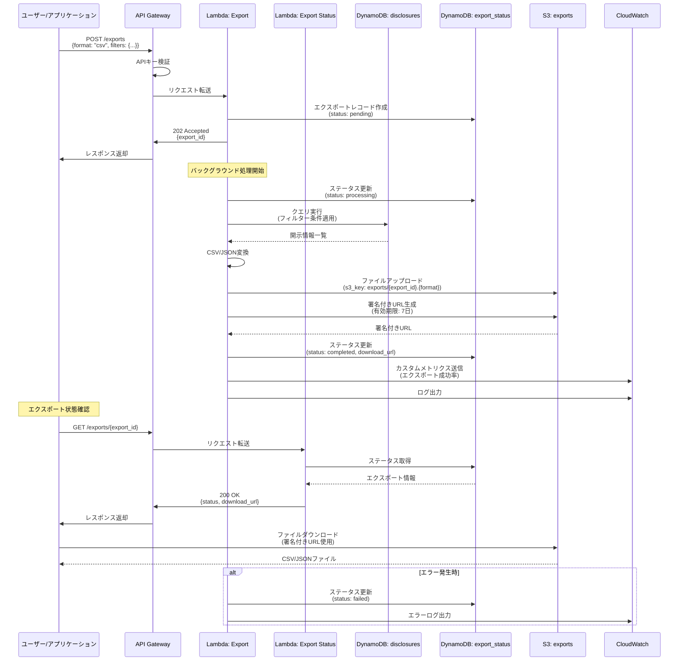

# TDnet Data Collector - データフロー図

## 概要

このドキュメントでは、TDnet Data Collectorシステムにおける主要なデータフローを図示します。

## 1. データ収集フロー

TDnetから開示情報を収集し、DynamoDBとS3に保存するフロー。



### フロー詳細

1. **収集トリガー**
   - ユーザーまたはスケジューラーが `POST /collect` を呼び出し
   - APIキー認証を実施
   - Collect Lambda関数が実行レコードを作成し、Collector Lambda関数を非同期呼び出し

2. **データ収集**
   - Collector Lambda関数がTDnetから開示情報一覧を取得（レート制限: 1リクエスト/秒）
   - 各開示情報のPDFをダウンロード
   - PDFをS3にアップロード（キー: `YYYY/MM/DD/{disclosure_id}.pdf`）
   - メタデータをDynamoDBに保存

3. **状態管理**
   - 実行状態を `tdnet_executions` テーブルで管理
   - 収集件数、エラー情報をCloudWatchメトリクスとして送信

4. **エラーハンドリング**
   - 再試行可能なエラー: 指数バックオフで再試行
   - 再試行不可能なエラー: DLQに送信し、アラーム発火

## 2. APIクエリフロー

開示情報をクエリし、PDF署名付きURLを返却するフロー。



### フロー詳細

1. **リクエスト受信**
   - WAFでレート制限チェック（2000リクエスト/5分）
   - API GatewayでAPIキー認証

2. **クエリ処理**
   - Secrets ManagerからAPIキーを取得し、再検証
   - DynamoDBのGSI（`company_code` + `disclosed_at`）でクエリ実行
   - 各開示情報のPDF署名付きURLを生成（有効期限: 1時間）

3. **レスポンス返却**
   - 開示情報一覧とPDF署名付きURLを返却
   - CloudWatchメトリクス（クエリレイテンシ）を送信

4. **エラーハンドリング**
   - バリデーションエラー: 400 Bad Request
   - 内部エラー: 500 Internal Server Error

## 3. エクスポートフロー

開示情報をCSV/JSON形式でエクスポートするフロー。



### フロー詳細

1. **エクスポートリクエスト**
   - ユーザーが `POST /exports` を呼び出し
   - Export Lambda関数がエクスポートレコードを作成（status: pending）
   - 即座に `export_id` を返却（202 Accepted）

2. **エクスポート処理**
   - バックグラウンドでDynamoDBからデータを取得
   - CSV/JSON形式に変換
   - S3にアップロード（有効期限: 7日）
   - 署名付きURLを生成

3. **状態確認**
   - ユーザーが `GET /exports/{export_id}` で状態を確認
   - Export Status Lambda関数がDynamoDBから状態を取得
   - 完了時は `download_url` を返却

4. **ファイルダウンロード**
   - ユーザーが署名付きURLでS3から直接ダウンロード
   - 7日後に自動削除（S3ライフサイクルポリシー）

## 4. 監視フロー

CloudWatchによる包括的な監視とアラート通知フロー。

```mermaid
graph TB
    subgraph "Lambda関数"
        L1[Collector]
        L2[Query]
        L3[Export]
        L4[Collect]
        L5[Collect Status]
        L6[Export Status]
        L7[PDF Download]
    end
    
    subgraph "CloudWatch"
        Logs[CloudWatch Logs]
        Metrics[CloudWatch Metrics]
        Alarms[CloudWatch Alarms]
        Dashboard[CloudWatch Dashboard]
    end
    
    subgraph "アラート"
        SNS[SNS Topic]
        Email[メール通知]
        Slack[Slack通知<br/>オプション]
    end
    
    subgraph "DLQ"
        DLQ[SQS DLQ]
        DLQProcessor[DLQ Processor Lambda]
    end

    %% Lambda → CloudWatch Logs
    L1 -->|ログ出力| Logs
    L2 -->|ログ出力| Logs
    L3 -->|ログ出力| Logs
    L4 -->|ログ出力| Logs
    L5 -->|ログ出力| Logs
    L6 -->|ログ出力| Logs
    L7 -->|ログ出力| Logs

    %% Lambda → CloudWatch Metrics
    L1 -->|カスタムメトリクス<br/>収集件数、成功率| Metrics
    L2 -->|カスタムメトリクス<br/>クエリレイテンシ| Metrics
    L3 -->|カスタムメトリクス<br/>エクスポート成功率| Metrics
    L4 -->|カスタムメトリクス| Metrics
    L5 -->|カスタムメトリクス| Metrics
    L6 -->|カスタムメトリクス| Metrics
    L7 -->|カスタムメトリクス| Metrics

    %% Lambda → DLQ
    L1 -.->|失敗時| DLQ
    L2 -.->|失敗時| DLQ
    L3 -.->|失敗時| DLQ

    %% DLQ → DLQ Processor
    DLQ -->|メッセージ| DLQProcessor
    DLQProcessor -->|ログ出力| Logs
    DLQProcessor -->|メトリクス| Metrics

    %% CloudWatch Metrics → Alarms
    Metrics -->|閾値超過| Alarms

    %% Alarms → SNS
    Alarms -->|アラーム発火| SNS

    %% SNS → 通知先
    SNS -->|通知| Email
    SNS -.->|通知<br/>オプション| Slack

    %% Dashboard
    Logs -->|表示| Dashboard
    Metrics -->|表示| Dashboard
    Alarms -->|表示| Dashboard

    style L1 fill:#ff9900
    style L2 fill:#ff9900
    style L3 fill:#ff9900
    style L4 fill:#ff9900
    style L5 fill:#ff9900
    style L6 fill:#ff9900
    style L7 fill:#ff9900
    style Logs fill:#ff9900
    style Metrics fill:#ff9900
    style Alarms fill:#ff9900
    style Dashboard fill:#ff9900
    style SNS fill:#ff9900
    style DLQ fill:#ff9900
    style DLQProcessor fill:#ff9900
```

### 監視項目

#### 1. Lambda関数メトリクス
- **呼び出し数**: 各Lambda関数の呼び出し回数
- **エラー率**: エラー発生率（閾値: 10%）
- **実行時間**: 平均実行時間（閾値: タイムアウトの70%）
- **スロットリング**: 同時実行数制限によるスロットリング

#### 2. カスタムメトリクス
- **TDnet/Collector**:
  - 収集件数（件/日）
  - 収集成功率（%）
  - PDF ダウンロード成功率（%）
- **TDnet/Query**:
  - クエリレイテンシ（ms）
  - クエリ成功率（%）
- **TDnet/Export**:
  - エクスポート成功率（%）
  - エクスポート処理時間（秒）

#### 3. DLQメトリクス
- **メッセージ数**: DLQに送信されたメッセージ数（閾値: 1件以上）
- **メッセージ年齢**: 最古メッセージの経過時間

#### 4. アラーム
- **Lambda関数エラー率**: 10%超過時にアラーム
- **Lambda関数実行時間**: タイムアウトの70%超過時にアラーム
- **DLQメッセージ数**: 1件以上でアラーム
- **収集成功率**: 95%未満でアラーム

### アラート通知フロー

1. **メトリクス収集**
   - Lambda関数がCloudWatch Logsにログ出力
   - Lambda関数がCloudWatch Metricsにカスタムメトリクス送信

2. **アラーム評価**
   - CloudWatch Alarmsが定期的にメトリクスを評価
   - 閾値超過時にアラーム状態に遷移

3. **通知送信**
   - アラーム発火時にSNS Topicに通知
   - SNSからメール/Slackに通知

4. **DLQ処理**
   - Lambda関数失敗時にDLQにメッセージ送信
   - DLQ Processor Lambda関数が自動処理
   - エラー内容をログ出力し、メトリクス送信

## データフロー設計原則

### 1. 非同期処理
- 長時間処理（データ収集、エクスポート）は非同期で実行
- 即座にレスポンスを返却し、状態確認APIで進捗を確認

### 2. エラーハンドリング
- 再試行可能なエラー: 指数バックオフで再試行
- 再試行不可能なエラー: DLQに送信し、アラーム発火
- 部分的失敗: 成功分をコミット、失敗分を記録

### 3. レート制限
- TDnet: 1リクエスト/秒（`RateLimiter`使用）
- API Gateway: 100リクエスト/秒、200バーストリクエスト
- WAF: 2000リクエスト/5分

### 4. データ整合性
- `disclosure_id`: 一意性保証（`generateDisclosureId`）
- `date_partition`: YYYY-MM形式、JST基準（`generateDatePartition`）
- トランザクション: DynamoDB条件付き書き込み

### 5. セキュリティ
- **認証**: APIキー認証（Secrets Manager管理）
- **暗号化**: HTTPS/TLS 1.2以上、S3/DynamoDB暗号化
- **署名付きURL**: 有効期限付き（1時間〜7日）
- **監査**: CloudTrail全APIコール記録

### 6. パフォーマンス
- **DynamoDB GSI**: 効率的なクエリ（`company_code` + `disclosed_at`、`date_partition` + `disclosed_at`）
- **S3署名付きURL**: Lambda経由せず直接ダウンロード
- **CloudFront**: 静的ファイルのキャッシング

## 参考資料

- [architecture.md](../.kiro/specs/tdnet-data-collector/design/architecture.md) - アーキテクチャ設計書
- [README.md](../README.md) - プロジェクト概要
- [cost-estimation.md](./cost-estimation.md) - コスト見積もり
- [ci-cd-pipeline.md](./ci-cd-pipeline.md) - CI/CDパイプライン
