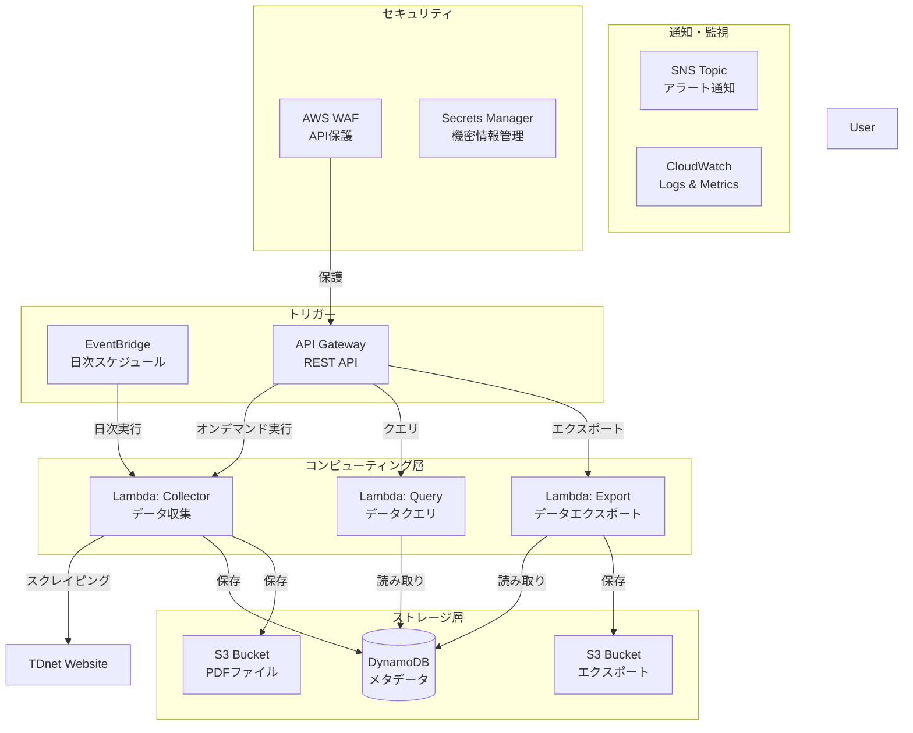
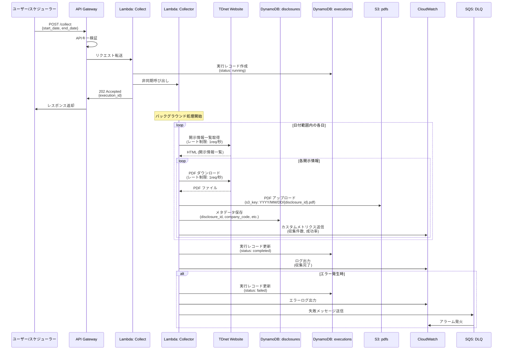
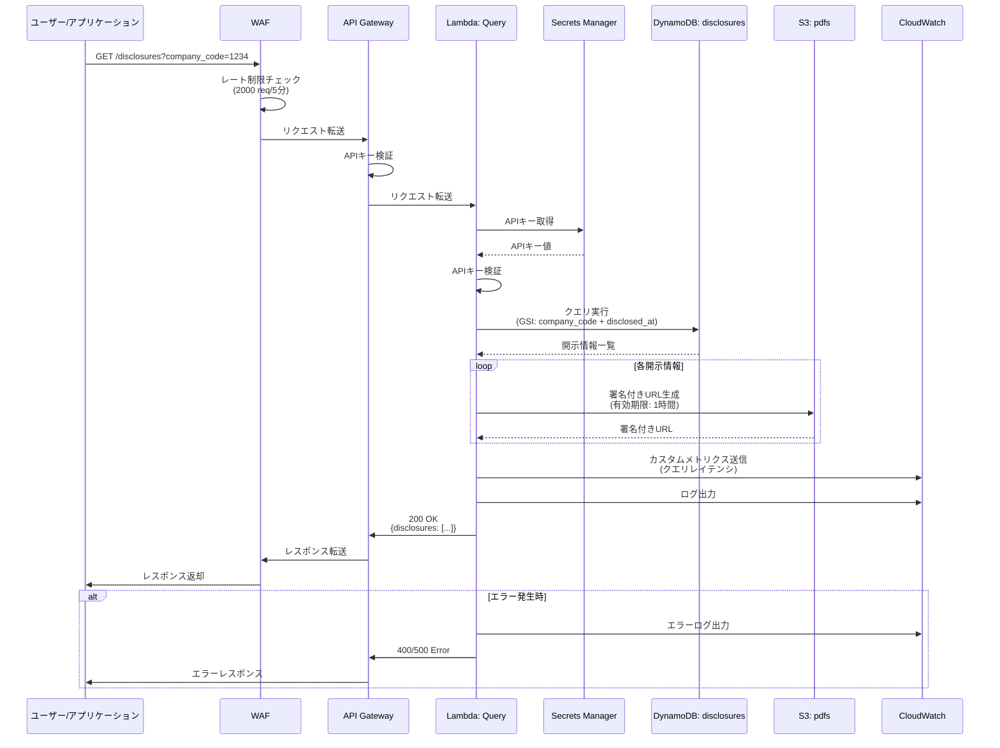
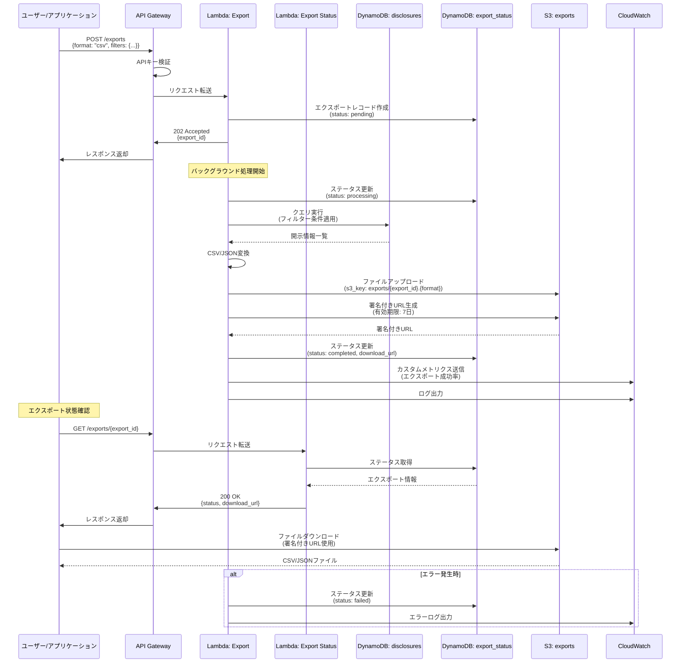

# Design Document: TDnet Data Collector

**バージョン:** 1.0.0  
**最終更新:** 2026-02-15

---

## Overview

TDnet Data Collectorは、日本取引所グループが提供するTDnet（適時開示情報閲覧サービス）から上場企業の開示情報を自動収集し、AWS上でコスト効率的に運用するサーバーレスシステムです。

### 設計の主要な決定事項

1. **サーバーレスアーキテクチャ**: AWS Lambdaを使用し、常時稼働するサーバーを不要にすることでコストを最小化
2. **実装言語**: TypeScript/Node.js 20.x - CDKとの統合、型安全性、豊富なエコシステムを理由に採用
3. **Webスクレイピング**: 公式APIは存在するが、コストが高いため、HTMLパースによるスクレイピングを採用
4. **イベント駆動**: EventBridgeによるスケジューリングとAPI Gatewayによるオンデマンド実行
5. **マネージドサービス活用**: DynamoDB（メタデータ）とS3（PDFファイル）により運用負荷を削減
6. **静的Webホスティング**: S3 + CloudFrontで低コストなダッシュボードを実現

## Architecture

### システム構成図



**詳細**: 9個のLambda関数（Collector, Query, Export, Collect, Collect Status, Export Status, PDF Download, Health, Stats）が存在。

### データフロー

#### 1. データ収集フロー



**フロー詳細:**
1. **収集トリガー**: ユーザーまたはスケジューラーが `POST /collect` を呼び出し、APIキー認証を実施
2. **データ収集**: Collector Lambda関数がTDnetから開示情報一覧を取得（レート制限: 1リクエスト/秒）
3. **状態管理**: 実行状態を `tdnet_executions` テーブルで管理
4. **エラーハンドリング**: 再試行可能なエラーは指数バックオフで再試行、再試行不可能なエラーはDLQに送信

#### 2. APIクエリフロー



**フロー詳細:**
1. **リクエスト受信**: WAFでレート制限チェック（2000リクエスト/5分）、API GatewayでAPIキー認証
2. **クエリ処理**: DynamoDBのGSI（`company_code` + `disclosed_at`）でクエリ実行
3. **レスポンス返却**: 開示情報一覧とPDF署名付きURLを返却

#### 3. エクスポートフロー



**フロー詳細:**
1. **エクスポートリクエスト**: ユーザーが `POST /exports` を呼び出し、即座に `export_id` を返却（202 Accepted）
2. **エクスポート処理**: バックグラウンドでDynamoDBからデータを取得、CSV/JSON形式に変換、S3にアップロード
3. **状態確認**: ユーザーが `GET /exports/{export_id}` で状態を確認
4. **ファイルダウンロード**: ユーザーが署名付きURLでS3から直接ダウンロード（7日後に自動削除）

### データフロー設計原則

1. **非同期処理**: 長時間処理（データ収集、エクスポート）は非同期で実行
2. **エラーハンドリング**: 再試行可能なエラーは指数バックオフで再試行、再試行不可能なエラーはDLQに送信
3. **レート制限**: TDnet: 1リクエスト/秒、API Gateway: 100リクエスト/秒、WAF: 2000リクエスト/5分
4. **データ整合性**: `disclosure_id`の一意性保証、`date_partition`はYYYY-MM形式（JST基準）
5. **セキュリティ**: APIキー認証、HTTPS/TLS 1.2以上、S3/DynamoDB暗号化、署名付きURL（有効期限付き）
6. **パフォーマンス**: DynamoDB GSI、S3署名付きURL（Lambda経由せず直接ダウンロード）、CloudFrontキャッシング

## Components

### 1. Lambda Collector（データ収集）

**責務:** TDnetからのWebスクレイピング、メタデータ抽出、PDFダウンロード、データ永続化

**主要な関数:**
- `scrapeTdnetList(date)`: 指定日の開示情報リスト取得
- `downloadPdf(url, s3Key)`: PDFダウンロードとS3保存
- `saveMetadata(disclosure)`: メタデータをDynamoDBに保存（date_partitionは呼び出し元で設定済みであること）
- `checkDuplicate(disclosureId)`: 重複チェック

**実装詳細**: `../../steering/development/tdnet-scraping-patterns.md`

### 2. Lambda Query（データクエリ）

**責務:** DynamoDBからのデータ取得、フィルタリング、エクスポート形式変換（JSON/CSV）、S3署名付きURL生成

**主要な関数:**
- `queryDisclosures(filters)`: 条件に合致する開示情報を取得
- `generatePresignedUrl(s3Key)`: S3署名付きURL生成
- `formatAsCsv(disclosures)`: CSV形式変換

**実装詳細**: `../../steering/api/api-design-guidelines.md`

### 3. Lambda Export（データエクスポート）

**責務:** 大量データの非同期エクスポート、S3保存、実行状態管理

**主要な関数:**
- `createExportJob(request)`: エクスポートジョブ作成
- `processExport(exportId, request)`: エクスポート処理実行
- `exportToS3(exportId, disclosures, format)`: S3エクスポート

**大量データ対応:** 10,000件以上はページネーション、50,000件超はStep Functions検討

### 4. API Gateway

**エンドポイント:**
- `POST /collect`: オンデマンドデータ収集
- `GET /collect/{execution_id}`: 収集実行状態取得
- `GET /disclosures`: 開示情報クエリ（最大100件）
- `POST /exports`: 大量データ非同期エクスポート
- `GET /exports/{export_id}`: エクスポート状態取得
- `GET /disclosures/{disclosure_id}/pdf`: PDF署名付きURL取得

**認証:** API Gateway使用量プランとAPIキー機能（Lambda関数では認証処理なし）

**詳細**: `openapi.yaml`, `../../steering/api/api-design-guidelines.md`

### 5. DynamoDB

**テーブル1: tdnet_disclosures（開示情報）**
- PK: `disclosure_id`
- GSI: `date_partition` + `disclosed_at`（月単位クエリ高速化）
- 属性: company_code, company_name, disclosure_type, title, disclosed_at, pdf_s3_key, downloaded_at, file_size

**テーブル2: tdnet_executions（実行状態）**
- PK: `execution_id`
- TTL: 30日後自動削除
- 属性: execution_type, status, progress, started_at, completed_at, result, error_message

**詳細**: `../../steering/development/data-validation.md`

### 6. S3

**バケット1: tdnet-data-collector-pdfs-{account-id}**
- ディレクトリ: `/pdfs/YYYY/MM/DD/{company_code}_{disclosure_type}_{timestamp}.pdf`
- ライフサイクル: 90日後Standard-IA、365日後Glacier
- 暗号化: SSE-S3、バージョニング有効

**バケット2: tdnet-data-collector-exports-{account-id}**
- ライフサイクル: 7日後自動削除

**バケット3: tdnet-dashboard-{account-id}**
- 静的Webサイトホスティング、CloudFront OAI保護

**バケット4: tdnet-cloudtrail-logs-{account-id}**
- ライフサイクル: 90日後Glacier、7年後削除

**詳細**: `../../steering/infrastructure/performance-optimization.md`

### 7. Webダッシュボード

**技術スタック:** React + TypeScript, Material-UI/Ant Design, S3 + CloudFront

**主要機能:** 開示情報一覧、検索・フィルタリング、PDFダウンロード、エクスポート、実行状態表示

**実行状態取得:** ポーリング方式（5秒間隔）、将来的にWebSocket検討

### 8. セキュリティコンポーネント

**AWS WAF:** レート制限（2000リクエスト/IP）、AWSマネージドルール

**Secrets Manager:** `/tdnet/api-key`（API Gateway認証用、$0.40/月）

**CloudTrail:** すべてのAPI呼び出し記録、S3保存、7年保持

**詳細**: `../../steering/security/security-best-practices.md`

### 9. 監視コンポーネント

**SNS Topic:** Critical/High/Mediumアラート通知

**CloudWatch:**
- カスタムメトリクス（3個）: DisclosuresCollected, DisclosuresFailed, CollectionSuccessRate
- Lambda標準メトリクス: Invocations, Errors, Duration, Throttles
- DynamoDB標準メトリクス: ConsumedReadCapacityUnits, ConsumedWriteCapacityUnits
- S3標準メトリクス: AllRequests, PutRequests, GetRequests

**CloudWatch Dashboard:** Lambda実行、DynamoDB、S3、API Gateway、ビジネスメトリクス

**詳細**: `../../steering/infrastructure/monitoring-alerts.md`

## Data Models

### Disclosure（開示情報）

```typescript
export interface Disclosure {
    disclosure_id: string;          // 一意識別子
    company_code: string;           // 企業コード
    company_name: string;           // 企業名
    disclosure_type: string;        // 開示種類
    title: string;                  // タイトル
    disclosed_at: string;           // 開示日時（ISO8601）
    pdf_s3_key: string;            // S3オブジェクトキー
    downloaded_at: string;         // ダウンロード日時（ISO8601）
    file_size: number;             // ファイルサイズ（bytes）
    date_partition: string;        // YYYY-MM形式
}

export function generateDatePartition(disclosedAt: string): string {
    // ISO8601形式から年月部分を抽出（YYYY-MM）
    return disclosedAt.substring(0, 7);
}
```

**詳細**: `../../steering/development/data-validation.md`

### その他のモデル

- `CollectionResult`: 収集結果（collected_count, failed_count, skipped_count, execution_time, errors）
- `ExecutionStatus`: 実行状態（execution_id, status, progress, started_at, completed_at, result）
- `ExportResult`: エクスポート結果（export_count, file_size, s3_key, download_url, expires_at）
- `QueryFilter`: クエリフィルタ（company_code, start_date, end_date, disclosure_type, limit, offset）

## Correctness Properties

*プロパティとは、システムのすべての有効な実行において真であるべき特性や動作のことです。*

### 主要プロパティ（15個）

1. **日付範囲収集の完全性**: 指定期間内のすべての開示情報を収集
2. **メタデータとPDFの同時取得**: 両方が取得され永続化される
3. **メタデータの必須フィールド**: すべての必須フィールドが記録される
4. **開示IDの一意性**: すべての開示IDは一意
5. **重複収集の冪等性**: 同じ開示情報を2回収集しても1件のみ保存
6. **PDFファイルの整合性**: ファイルサイズ10KB-50MB、PDFヘッダー検証
7. **エラー時の部分的成功**: 成功分は永続化、失敗分はエラーログ記録
8. **日付範囲の順序性**: 開始日が終了日より後の場合はエラー
9. **APIキー認証の必須性**: 有効なAPIキーがない場合は401
10. **エクスポートファイルの有効期限**: 7日後自動削除
11. **実行状態の進捗単調性**: 進捗率は単調増加（0→100）
12. **レート制限の遵守**: 設定された遅延時間以上の間隔
13. **ログレベルの適切性**: ERROR/WARNING/INFO/DEBUGレベル
14. **暗号化の有効性**: S3とDynamoDBで暗号化有効
15. **テストカバレッジの維持**: 80%以上

**実装詳細**: `correctness-properties-checklist.md`, `../../steering/development/testing-strategy.md`

## Testing Strategy

### テストレベル

| テスト種別 | 比率 | カバレッジ目標 | 実装場所 |
|-----------|------|--------------|---------|
| ユニットテスト | 70% | 80%以上 | `tests/unit/` |
| 統合テスト | 20% | 主要フロー | `tests/integration/` |
| E2Eテスト | 10% | クリティカルパス | `tests/e2e/` |
| プロパティテスト | - | 15プロパティ | `tests/properties/` |

### テスト実装優先度

**Phase 1:** Property 2, 3, 4, 8, 12（基本的なデータ処理、レート制限）  
**Phase 2:** Property 1, 5, 9（データ収集、API認証）  
**Phase 3:** Property 6, 7, 11, 13, 10, 14, 15（エラーハンドリング、インフラ）

**詳細**: `../../steering/development/testing-strategy.md`

## CI/CDパイプライン

### GitHub Actions ワークフロー

**テストワークフロー (.github/workflows/test.yml):**
- Linter, Type Check, Unit Tests, Property Tests
- カバレッジ80%チェック、Codecovアップロード
- Security Audit

**デプロイワークフロー (.github/workflows/deploy.yml):**
- テスト実行、ビルド、CDK Diff/Deploy
- スモークテスト、Slack通知

**依存関係更新 (.github/workflows/dependency-update.yml):**
- 毎週月曜日、自動PR作成

### デプロイ戦略

**環境分離:** dev/prod環境で異なる設定（タイムアウト、メモリ、ログレベル）

**Lambda関数タイムアウト:**
- Collector: 15分（本番）、5分（開発）
- Query: 30秒
- Export: 5分

**ブルーグリーンデプロイ:** CodeDeployで段階的デプロイ（CANARY_10PERCENT_5MINUTES）

**詳細**: `../../steering/infrastructure/deployment-checklist.md`

### CloudFormation Outputs

主要なOutputs: ApiEndpoint, DisclosuresTableName, ExecutionsTableName, PdfBucketName, ExportBucketName, DashboardBucketName, CollectorFunctionName/Arn, QueryFunctionName, ExportFunctionName, CloudFrontUrl, ApiKeySecretArn, DashboardUrl

**取得方法:**
```bash
aws cloudformation describe-stacks --stack-name tdnet-data-collector-dev --query 'Stacks[0].Outputs'
cdk deploy --outputs-file outputs.json
```

## パフォーマンスベンチマーク

### Lambda Collector

| メトリクス | 目標値 | 根拠 |
|-----------|--------|------|
| 1件あたり収集時間 | 5秒以内 | スクレイピング(1秒) + PDFダウンロード(2秒) + 保存(1秒) + バッファ(1秒) |
| 日次バッチ実行時間 | 5分以内 | 50件 × 5秒、並列処理で短縮 |
| メモリ使用量 | 256MB以下 | PDFバッファ(50MB) + Node.js(100MB) + バッファ(106MB) |
| 並列処理数 | 5件同時 | レート制限遵守 |

### Lambda Query/Export

| メトリクス | 目標値 |
|-----------|--------|
| クエリ応答時間 | 500ms以内 |
| 100件取得時間 | 1秒以内 |
| 1,000件エクスポート | 30秒以内 |
| 10,000件エクスポート | 5分以内 |

### DynamoDB/S3

| メトリクス | 目標値 |
|-----------|--------|
| 書き込みレイテンシ | 10ms以内 |
| 読み取りレイテンシ | 5ms以内 |
| PDFアップロード | 2秒以内 |
| 署名付きURL生成 | 50ms以内 |

**詳細**: `../../steering/infrastructure/performance-optimization.md`

## データ保持ポリシー

### DynamoDB

| テーブル | 保持期間 | 削除方法 |
|---------|---------|---------|
| tdnet_disclosures | 無期限 | 手動削除のみ（5年以上経過データはS3アーカイブ推奨） |
| tdnet_executions | 30日 | TTL自動削除 |

### S3

| バケット | ストレージクラス | 保持期間 |
|---------|----------------|---------|
| PDFs | Standard | 90日 |
| PDFs | Standard-IA | 90日〜365日 |
| PDFs | Glacier | 365日〜無期限 |
| Exports | Standard | 7日（自動削除） |
| CloudTrail | Standard | 90日 |
| CloudTrail | Glacier | 90日〜7年（自動削除） |

### CloudWatch Logs

| ログ種別 | 保持期間（本番） | 保持期間（開発） |
|---------|----------------|----------------|
| Lambda Collector | 3ヶ月 | 1週間 |
| Lambda Query/Export | 1ヶ月 | 1週間 |

## コスト見積もり

**前提条件:** 個人利用、月間1,000件の開示情報収集

### 月間コスト試算

| カテゴリ | 月額 |
|---------|------|
| Lambda | $0.00（無料枠内） |
| DynamoDB | $0.25 |
| S3 | $0.34 |
| API Gateway + CloudFront | $0.16 |
| CloudWatch | $7.50 |
| WAF + Secrets Manager + CloudTrail | $7.42 |
| **合計** | **$15.67/月** |

### コスト最適化提案

1. CloudWatch削減: カスタムメトリクス5個に削減 → -$1.50/月
2. WAF削減: 開発環境で無効化 → -$7.01/月（dev環境）
3. ログ保持期間短縮: 1週間 → -$0.38/月

**最適化後:** 約$8.00/月（本番）、約$1.00/月（開発）

**詳細**: `../../steering/infrastructure/performance-optimization.md`

## Implementation Considerations

### パフォーマンス最適化

1. **並列処理**: Promise.allで複数開示情報を並列ダウンロード
2. **バッチ書き込み**: DynamoDBバッチ書き込みで回数削減
3. **キャッシング**: 重複チェック結果をメモリキャッシュ
4. **ストリーム処理**: 大量データエクスポート時

### エラーリカバリー

1. **チェックポイント**: 長時間実行時は定期的に保存
2. **リトライ**: 指数バックオフで再試行
3. **デッドレターキュー**: 処理失敗メッセージをDLQに送信
4. **手動リカバリー**: DLQからの手動リカバリー機能

### セキュリティ考慮事項

1. **最小権限の原則**: IAMロールは必要最小限の権限のみ
2. **シークレット管理**: APIキーはSecrets Managerで管理
3. **監査ログ**: CloudTrailですべてのAPI呼び出しを記録
4. **暗号化**: 保管時・転送時の暗号化を有効化

**詳細**: `../../steering/security/security-best-practices.md`, `../../steering/core/error-handling-patterns.md`

---

## 関連ドキュメント

### 要件・仕様

- **[要件定義書](./requirements.md)** - 本設計の基となる要件定義（要件1-15）
- **[OpenAPI仕様](./openapi.yaml)** - REST API詳細仕様
- **[Correctness Propertiesチェックリスト](./correctness-properties-checklist.md)** - 設計検証項目

### 実装・運用

- **[実装チェックリスト](./implementation-checklist.md)** - 実装開始前の確認項目（16カテゴリ、100項目以上）
- **[環境構築ガイド](./environment-setup.md)** - 開発環境のセットアップ手順

### 実装ガイドライン（Steering）

プロジェクトルートの `.kiro/steering/` フォルダに実装ガイドラインがあります：

#### コア実装ルール
- **[実装ルール](../../steering/core/tdnet-implementation-rules.md)** - コーディング規約、命名規則、ベストプラクティス
- **[エラーハンドリング](../../steering/core/error-handling-patterns.md)** - 再試行戦略、エラー分類、ログ構造
- **[タスク実行ルール](../../steering/core/tdnet-data-collector.md)** - タスク管理、フィードバックループ

#### 開発ガイドライン
- **[テスト戦略](../../steering/development/testing-strategy.md)** - ユニット、統合、E2E、プロパティテスト
- **[データバリデーション](../../steering/development/data-validation.md)** - バリデーションルール、Zodパターン
- **[スクレイピングパターン](../../steering/development/tdnet-scraping-patterns.md)** - TDnetスクレイピング実装、レート制限

#### インフラ・運用
- **[デプロイチェックリスト](../../steering/infrastructure/deployment-checklist.md)** - デプロイ前後の確認、ロールバック手順
- **[環境変数管理](../../steering/infrastructure/environment-variables.md)** - 環境変数一覧、Secrets Manager使用方法
- **[パフォーマンス最適化](../../steering/infrastructure/performance-optimization.md)** - Lambda最適化、DynamoDB設計、S3戦略
- **[監視とアラート](../../steering/infrastructure/monitoring-alerts.md)** - CloudWatchメトリクス、アラーム設定

#### セキュリティ・API
- **[セキュリティベストプラクティス](../../steering/security/security-best-practices.md)** - IAM、暗号化、監査ログ
- **[API設計ガイドライン](../../steering/api/api-design-guidelines.md)** - RESTful設計、エラーレスポンス

### 設計セクションとSteeringの対応表

| 設計セクション | 関連Steering | 説明 |
|--------------|-------------|------|
| アーキテクチャ | tdnet-implementation-rules.md | 全体構成、技術選択 |
| コンポーネント設計 | tdnet-implementation-rules.md | Lambda、DynamoDB、S3設計 |
| データモデル | data-validation.md | テーブル設計、バリデーション |
| API設計 | api-design-guidelines.md | エンドポイント、リクエスト/レスポンス |
| エラー処理 | error-handling-patterns.md | 再試行戦略、エラー分類 |
| セキュリティ | security-best-practices.md | IAM、暗号化、WAF |
| 監視 | monitoring-alerts.md | メトリクス、アラーム |
| CI/CD | deployment-checklist.md | GitHub Actions、デプロイ戦略 |
| テスト戦略 | testing-strategy.md | テストレベル、カバレッジ |
| パフォーマンス | performance-optimization.md | Lambda最適化、DynamoDB設計 |

---

**最終更新:** 2026-02-15
