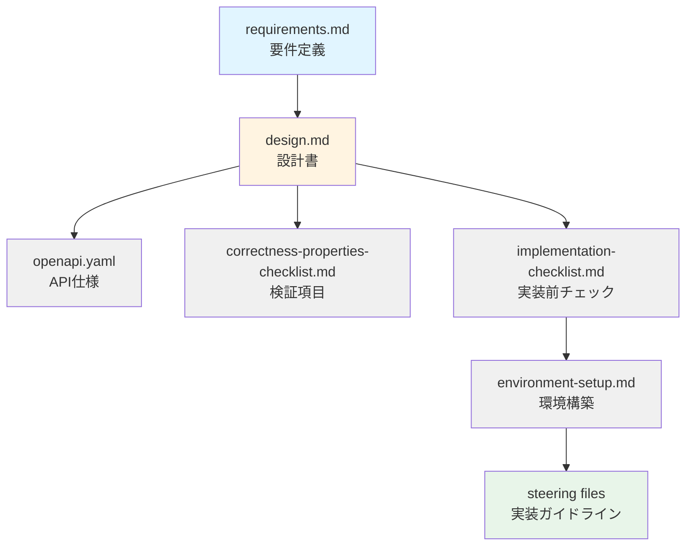

# Requirements Document

**バージョン:** 1.0.0  
**最終更新:** 2026-02-15

---

## Introduction

TDnet Data Collectorは、日本取引所グループが提供するTDnet（適時開示情報閲覧サービス）から上場企業の開示情報を自動収集するシステムです。個人投資家がコストを抑えながら、投資判断とデータ分析のために開示情報を効率的に収集・管理できることを目的としています。

## 用語集

- **TDnet**: 日本取引所グループが提供する適時開示情報閲覧サービス
- **システム**: TDnet Data Collectorシステム
- **開示情報**: 上場企業が公開する適時開示情報（決算短信、業績予想、IR資料など）
- **メタデータ**: 開示情報の属性情報（企業コード、開示日時、開示種類、タイトルなど）
- **バッチ収集**: 定期的に自動実行されるデータ収集処理
- **オンデマンド収集**: ユーザーが任意のタイミングで実行するデータ収集処理
- **ストレージ層**: データを永続化する層（データベースとファイルストレージの具体的な技術は設計フェーズで決定）
- **AWSインフラストラクチャ**: システムはAmazon Web Services上で構築・運用される

## 要件

### 要件1: データ収集機能

**ユーザーストーリー:** ユーザーとして、TDnetから開示情報を収集したい。なぜなら、投資判断と分析のために企業の開示データにアクセスする必要があるから。

#### 受入基準

1. ユーザーが日付範囲を指定してオンデマンド収集を開始したとき、システムはその期間内に公開されたすべての開示情報を取得しなければならない
2. ユーザーがバッチ収集を開始したとき、システムは当日公開されたすべての開示情報を取得しなければならない
3. 開示情報を取得するとき、システムはメタデータとPDFファイルの両方をダウンロードしなければならない
4. 開示情報の取得に成功したとき、システムはメタデータとPDFファイルを永続的に保存しなければならない
5. システムは日本の取引所に上場するすべての企業の収集をサポートしなければならない

### 要件2: メタデータ管理

**ユーザーストーリー:** ユーザーとして、開示情報のメタデータが適切に分類・保存されることを望む。なぜなら、データを効率的に検索・分析できるようにしたいから。

#### 受入基準

1. メタデータを保存するとき、システムは企業コード、企業名、開示日時、開示種類、タイトルを記録しなければならない
2. メタデータを保存するとき、システムはPDFファイルパスとダウンロードタイムスタンプを記録しなければならない
3. システムは各開示レコードに一意の識別子を割り当てなければならない
4. 重複する開示情報が検出されたとき、システムはダウンロードをスキップし、既存のレコードを維持しなければならない
5. システムはメタデータを永続的に保存するためのデータベース機構を提供しなければならない（データベース技術の選択は設計フェーズで決定する）

### 要件3: ファイル管理

**ユーザーストーリー:** ユーザーとして、PDFファイルが体系的に整理されることを望む。なぜなら、特定の開示情報を簡単に見つけてアクセスできるようにしたいから。

#### 受入基準

1. システムはPDFファイルを日付と企業コードで整理されたディレクトリ構造に保存しなければならない
2. PDFファイルを保存するとき、システムは企業コード、開示種類、タイムスタンプを含む命名規則を使用しなければならない
3. システムはダウンロード後にPDFファイルの整合性を検証しなければならない
4. PDFダウンロードが失敗したとき、システムはエラーをログに記録し、他の開示情報の処理を継続しなければならない
5. システムはファイルストレージ機構を提供しなければならない（ローカルストレージまたはクラウドストレージの選択は設計フェーズで決定する）

### 要件4: バッチ処理

**ユーザーストーリー:** ユーザーとして、自動的な日次収集をスケジュールしたい。なぜなら、手動操作なしで最新の開示情報を常に入手したいから。

#### 受入基準

1. システムは1日1回実行されるバッチ収集モードを提供しなければならない
2. バッチ収集が実行されるとき、システムは当日公開されたすべての開示情報を収集しなければならない
3. バッチ収集が完了したとき、システムは収集した開示情報の件数を含むサマリーレポートを生成しなければならない
4. バッチ収集がエラーに遭遇した場合、システムはエラーをログに記録し、通知を送信しなければならない
5. システムはcronまたは類似のスケジューリング機構によるスケジューリングをサポートしなければならない

### 要件5: 任意期間データ取得

**ユーザーストーリー:** ユーザーとして、指定した任意の期間の過去の開示データを取得したい。なぜなら、遡及的な分析を実行したいから。

#### 受入基準

1. ユーザーが開始日と終了日を指定したとき、システムはその期間内のすべての開示情報を取得しなければならない
2. システムは開始日が終了日より後でないことを検証しなければならない
3. 過去データを取得するとき、システムは開示情報を時系列順に処理しなければならない
4. システムは長時間実行される過去データ収集中に進捗フィードバックを提供しなければならない
5. 過去データ収集が中断されたとき、システムは最後に正常に処理された日付から再開することをサポートしなければならない

### 要件6: エラーハンドリングとロギング

**ユーザーストーリー:** ユーザーとして、システムがエラーを適切に処理し、詳細なログを提供することを望む。なぜなら、問題をトラブルシューティングし、データの整合性を確保したいから。

#### 受入基準

1. ネットワークエラーが発生したとき、システムは指数バックオフで最大3回リクエストを再試行しなければならない
2. TDnetサービスが利用できないとき、システムはエラーをログに記録し、正常に終了しなければならない
3. システムは成功と失敗を含むすべての収集活動をタイムスタンプ付きでログに記録しなければならない
4. 重大なエラーが発生したとき、システムは部分的な結果を保持し、回復を可能にしなければならない
5. システムは異なるログレベル（DEBUG、INFO、WARNING、ERROR）を提供しなければならない

### 要件7: データクエリとエクスポート

**ユーザーストーリー:** ユーザーとして、収集したデータをクエリし、さまざまな形式でエクスポートしたい。なぜなら、分析ツールやLLM/AIエージェントと統合したいから。

#### 受入基準

1. システムは企業コード、日付範囲、開示種類で開示情報を検索するクエリインターフェースを提供しなければならない
2. データをエクスポートするとき、システムはメタデータのJSON形式とCSV形式をサポートしなければならない
3. システムはプログラマティックアクセスのためのAPIまたはコマンドラインインターフェースを提供しなければならない
4. データをクエリするとき、システムは開示日の降順でソートされた結果を返さなければならない
5. システムは複数の条件による同時フィルタリングをサポートしなければならない

### 要件8: 設定管理

**ユーザーストーリー:** ユーザーとして、設定ファイルを通じてシステムの動作を設定したい。なぜなら、コードを変更せずに収集プロセスをカスタマイズしたいから。

#### 受入基準

1. システムは起動時に設定ファイルから設定を読み込まなければならない
2. システムはストレージ設定、ログレベルの設定をサポートしなければならない
3. システムは再試行回数、タイムアウト値、レート制限パラメータの設定をサポートしなければならない
4. 設定ファイルが存在しないとき、システムは妥当なデフォルト値を使用しなければならない
5. システムは設定値を検証し、無効な設定に対してエラーを報告しなければならない

### 要件9: レート制限とマナー

**ユーザーストーリー:** ユーザーとして、システムがTDnetサービスの制限を尊重することを望む。なぜなら、サービスに過負荷をかけずに責任を持ってデータを収集したいから。

#### 受入基準

1. システムはTDnetへの過度なリクエストを避けるためにレート制限を実装しなければならない
2. システムは連続するリクエスト間で設定可能な遅延を待機しなければならない
3. システムはHTTPリクエストに適切なUser-Agentヘッダーを含めなければならない
4. システムは該当する場合、robots.txtを尊重しなければならない
5. レート制限を超えたとき、システムは一時停止し、クールダウン期間後に再開しなければならない

### 要件10: Webダッシュボード

**ユーザーストーリー:** ユーザーとして、Webブラウザで開示情報を検索・閲覧したい。なぜなら、直感的なインターフェースで効率的にデータにアクセスしたいから。

#### 受入基準

1. システムはWebブラウザでアクセス可能なダッシュボードを提供しなければならない
2. ダッシュボードは開示情報の一覧をテーブル形式で表示しなければならない
3. ユーザーが企業名、企業コード、日付範囲、開示種類で検索・フィルタリングできるとき、システムは条件に一致する開示情報のみを表示しなければならない
4. ユーザーが開示情報を選択したとき、システムは対応するPDFファイルをダウンロードする機能を提供しなければならない
5. ダッシュボードは将来的にAIエージェントやLLMによる分析結果を表示できるように拡張可能な設計でなければならない

### 要件11: API認証

**ユーザーストーリー:** ユーザーとして、APIエンドポイントが認証で保護されることを望む。なぜなら、不正アクセスを防ぎ、システムを安全に運用したいから。

#### 受入基準

1. システムはすべてのAPIエンドポイントにAPIキー認証を実装しなければならない
2. APIリクエストを受信したとき、システムはHTTPヘッダー（`X-API-Key`）またはクエリパラメータ（`api_key`）でAPIキーを検証しなければならない
3. 無効なAPIキーまたは欠落したAPIキーでリクエストが送信されたとき、システムは401 Unauthorizedステータスコードを返さなければならない
4. システムはAPIキーを環境変数から読み込まなければならない
5. システムはAPIキーをログやエラーメッセージに出力してはならない

### 要件12: コスト最適化（AWS前提）

**ユーザーストーリー:** ユーザーとして、システムがAWS上で最小限のコストで運用されることを望む。なぜなら、個人利用のため運用コストを抑えたいから。

#### 受入基準

1. システムはAWS上でコスト効率の高いアーキテクチャを採用しなければならない
2. システムはAWSの無料枠を最大限活用する設計でなければならない
3. システムは常時稼働するEC2インスタンスを必要としないサーバーレスアーキテクチャを検討しなければならない
4. ストレージを使用する場合、システムはアクセス頻度に応じた適切なストレージクラス（S3 Standard、S3 Infrequent Access等）を選択しなければならない
5. システムは実行時間とリソース使用量を最小化する設計でなければならない

### 要件13: セキュリティとコンプライアンス

**ユーザーストーリー:** ユーザーとして、システムが適切なセキュリティ対策を実装し、データを安全に保護することを望む。なぜなら、企業の機密情報を扱うため、セキュリティ侵害のリスクを最小化したいから。

#### 受入基準

1. システムはすべてのAPIエンドポイントにWAF（Web Application Firewall）による保護を実装しなければならない
2. システムはCloudTrailによるすべてのAPI呼び出しの監査ログを記録しなければならない
3. S3バケットとDynamoDBテーブルは保管時の暗号化（Encryption at Rest）を有効化しなければならない
4. システムはAPIキーやシークレットをSecrets Managerまたは環境変数で安全に管理しなければならない
5. システムはS3バケットのパブリックアクセスをブロックし、署名付きURLでのみアクセスを許可しなければならない

### 要件14: テストとQA

**ユーザーストーリー:** ユーザーとして、システムが十分にテストされ、高品質であることを望む。なぜなら、データの正確性と信頼性が投資判断に直結するから。

#### 受入基準

1. システムはすべてのビジネスロジックに対してユニットテストを実装し、コードカバレッジ80%以上を維持しなければならない
2. システムはプロパティベーステスト（fast-check）を使用してCorrectness Propertiesを検証しなければならない
3. システムは統合テストを実装し、Lambda関数とAWSサービス間の連携を検証しなければならない
4. システムはE2Eテストを実装し、Webダッシュボードの主要機能を検証しなければならない
5. システムはCI/CDパイプラインでテストを自動実行し、テスト失敗時はデプロイを中止しなければならない

### 要件15: DR/バックアップ戦略（最小限の実装）

**ユーザーストーリー:** ユーザーとして、最小限のDR/バックアップ機能を持つことで、誤操作やシステム障害からの復旧を可能にしたい。なぜなら、データ再収集には時間がかかり、コストとのバランスを取りたいから。

#### 受入基準

1. システムはDynamoDBのPoint-in-Time Recovery（PITR）を有効化し、過去35日間の任意の時点への復元を可能にする
2. システムはS3バケットのバージョニングを有効化し、誤削除や上書きからの復元を可能にする
3. システムはCloudTrailログを7年間保持し、監査証跡を記録する
4. データ損失時は、TDnetから再収集することで復旧する方針とする（バックアップからの復元は補助的手段）
5. システムは定期的なバックアップテストを実施しない（コスト削減のため）

#### 実装状況

- ✅ DynamoDB PITR: 有効化済み（foundation-stack.ts）
- ✅ S3バージョニング: 有効化済み（foundation-stack.ts）
- ✅ CloudTrail: 7年間保存設定済み（monitoring-stack.ts）
- ✅ 再収集スクリプト: fetch-data-range.ps1, manual-data-collection.ps1

#### 理由

- **最小限のコスト**: AWS無料枠内で運用しつつ、基本的なDR機能を確保
- **データ再収集可能**: TDnetから過去データを再収集できるため、高度なバックアップは不要
- **誤操作対策**: バージョニングとPITRで人的ミスからの復旧を可能に
- **監査証跡**: CloudTrailで操作履歴を記録（セキュリティ要件13と連携）

#### 注意事項

本番環境で使用する場合や、企業向けに展開する場合は、以下の追加対策を検討すること：
- クロスリージョンレプリケーション
- 定期的な復旧テスト
- バックアップ自動化（AWS Backup）
- RPO/RTO目標の設定

---

## 関連ドキュメント

### 設計・実装

- **[設計書](./design.md)** - 本要件定義を基にした詳細設計
- **[OpenAPI仕様](./openapi.yaml)** - REST API仕様（要件2, 4, 5, 6に対応）
- **[実装チェックリスト](./implementation-checklist.md)** - 実装開始前の確認項目
- **[環境構築ガイド](./environment-setup.md)** - 開発環境のセットアップ手順

### 検証・テスト

- **[Correctness Propertiesチェックリスト](./correctness-properties-checklist.md)** - 要件検証項目（1-15）

### 実装ガイドライン（Steering）

プロジェクトルートの `.kiro/steering/` フォルダに実装ガイドラインがあります：

#### コア実装ルール
- **[実装ルール](../../steering/core/tdnet-implementation-rules.md)** - 基本的なコーディング規約とベストプラクティス
- **[エラーハンドリング](../../steering/core/error-handling-patterns.md)** - エラー処理パターン（要件11に対応）
- **[タスク実行ルール](../../steering/core/tdnet-data-collector.md)** - タスク管理とフィードバックループ

#### 開発ガイドライン
- **[テスト戦略](../../steering/development/testing-strategy.md)** - テスト実装のベストプラクティス（要件14に対応）
- **[データバリデーション](../../steering/development/data-validation.md)** - バリデーションルール（要件2, 3に対応）
- **[スクレイピングパターン](../../steering/development/tdnet-scraping-patterns.md)** - TDnetスクレイピングの実装（要件1に対応）

#### インフラ・運用
- **[デプロイチェックリスト](../../steering/infrastructure/deployment-checklist.md)** - デプロイ前後の確認項目（要件13に対応）
- **[環境変数管理](../../steering/infrastructure/environment-variables.md)** - 環境変数の定義と管理
- **[パフォーマンス最適化](../../steering/infrastructure/performance-optimization.md)** - 最適化戦略（要件9に対応）
- **[監視とアラート](../../steering/infrastructure/monitoring-alerts.md)** - 監視設定（要件12に対応）

#### セキュリティ・API
- **[セキュリティベストプラクティス](../../steering/security/security-best-practices.md)** - セキュリティガイドライン（要件10に対応）
- **[API設計ガイドライン](../../steering/api/api-design-guidelines.md)** - RESTful API設計（要件4, 5, 6に対応）

### ドキュメント依存関係

### 要件とドキュメントの対応表

| 要件 | 対応する設計書セクション | 関連Steering |
|------|----------------------|-------------|
| 要件1: データ収集 | Phase 1: 基本機能 | tdnet-scraping-patterns.md |
| 要件2: メタデータ管理 | データモデル | data-validation.md |
| 要件3: ファイル管理 | ストレージ設計 | - |
| 要件4: 検索API | Phase 2: API実装 | api-design-guidelines.md |
| 要件5: エクスポート | Phase 2: API実装 | api-design-guidelines.md |
| 要件6: 実行状態確認 | Phase 2: API実装 | api-design-guidelines.md |
| 要件7: スケジューリング | Phase 3: 自動化 | - |
| 要件8: 通知 | Phase 3: 自動化 | monitoring-alerts.md |
| 要件9: パフォーマンス | 非機能要件 | performance-optimization.md |
| 要件10: セキュリティ | セキュリティ設計 | security-best-practices.md |
| 要件11: エラーハンドリング | エラー処理設計 | error-handling-patterns.md |
| 要件12: 監視 | 監視設計 | monitoring-alerts.md |
| 要件13: デプロイ | CI/CD設計 | deployment-checklist.md |
| 要件14: テスト | テスト戦略 | testing-strategy.md |
| 要件15: DR/バックアップ | DR戦略 | - |

---

**最終更新:** 2026-02-07
