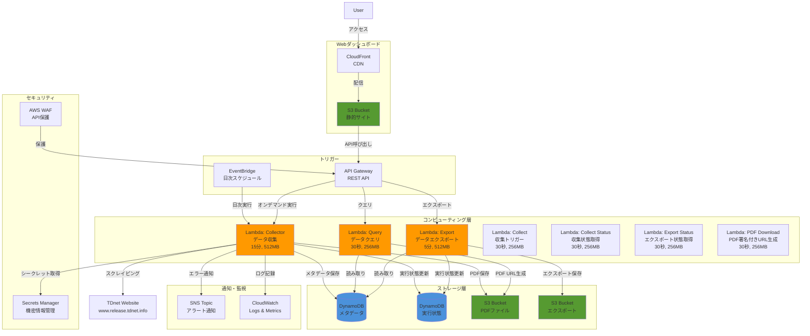
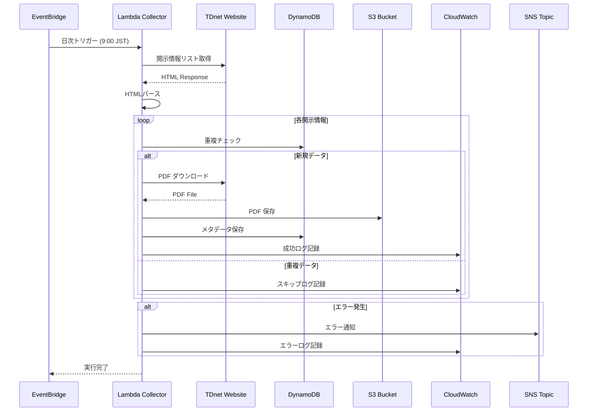
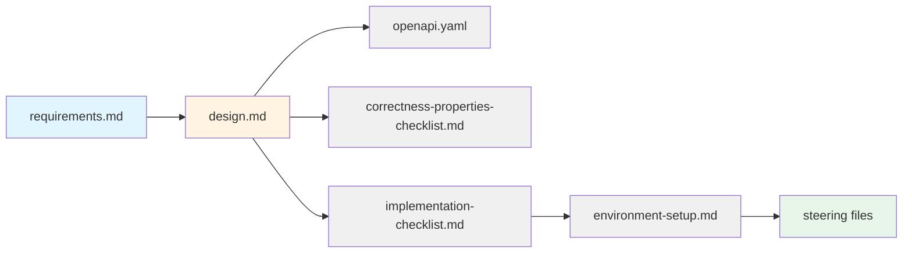

# Design Document: TDnet Data Collector

**バージョン:** 1.0.0  
**最終更新:** 2026-02-07

---

## 関連ドキュメント

- **要件定義書**: `requirements.md` - 機能要件と非機能要件
- **API仕様**: `openapi.yaml` - REST API仕様
- **Correctness Properties**: `correctness-properties-checklist.md` - 設計検証項目
- **実装チェックリスト**: `implementation-checklist.md` - 実装前の確認項目
- **メトリクスとKPI**: `metrics-and-kpi.md` - 成功指標とパフォーマンス目標
- **実装ルール**: `../../steering/core/tdnet-implementation-rules.md` - コーディング規約
- **API設計ガイドライン**: `../../steering/api/api-design-guidelines.md` - API設計原則
- **パフォーマンス最適化**: `../../steering/infrastructure/performance-optimization.md` - 最適化戦略

---

## Overview

TDnet Data Collectorは、日本取引所グループが提供するTDnet（適時開示情報閲覧サービス）から上場企業の開示情報を自動収集し、AWS上でコスト効率的に運用するサーバーレスシステムです。

### 設計の主要な決定事項

1. **サーバーレスアーキテクチャ**: AWS Lambdaを使用し、常時稼働するサーバーを不要にすることでコストを最小化
2. **実装言語**: TypeScript/Node.js 20.x - CDKとの統合、型安全性、豊富なエコシステムを理由に採用
3. **Webスクレイピング**: 公式APIは存在するが、コストが高いため、HTMLパースによるスクレイピングを採用（将来的にAPI移行を検討）
4. **イベント駆動**: EventBridgeによるスケジューリングとAPI Gatewayによるオンデマンド実行
5. **マネージドサービス活用**: DynamoDB（メタデータ）とS3（PDFファイル）により運用負荷を削減
6. **静的Webホスティング**: S3 + CloudFrontで低コストなダッシュボードを実現

## Architecture

### システム構成図（全体アーキテクチャ）



### データフロー図



**バッチ収集フロー:**
1. EventBridgeが毎日指定時刻にLambda Collectorを起動
2. Lambda CollectorがTDnetのWebページにアクセス
3. 当日の開示情報リストをHTMLパースで取得
4. 各開示情報のメタデータを抽出
5. PDFファイルをダウンロードしてS3に保存
6. メタデータをDynamoDBに保存
7. 実行結果をCloudWatch Logsに記録

**オンデマンド収集フロー:**
1. ユーザーがAPI Gateway経由でリクエスト（APIキー認証）
2. Lambda Collectorが日付範囲パラメータを受け取る
3. 指定期間の開示情報を収集（バッチ収集と同様の処理）
4. 実行結果をJSON形式で返却

**クエリフロー:**
1. ユーザーがダッシュボードまたはAPI経由でクエリ（APIキー認証）
2. Lambda QueryがDynamoDBから条件に合致するメタデータを取得
3. 必要に応じてS3の署名付きURLを生成
4. 結果をJSON/CSV形式で返却

## Components and Interfaces

### 1. Lambda Collector（データ収集）

**責務:**
- TDnetからのWebスクレイピング
- メタデータ抽出とPDFダウンロード
- データの永続化
- エラーハンドリングとリトライ

**インターフェース:**

```typescript
export interface CollectorEvent {
    mode: 'batch' | 'on-demand';
    start_date?: string;  // YYYY-MM-DD (on-demandの場合)
    end_date?: string;    // YYYY-MM-DD (on-demandの場合)
}

export interface CollectorResponse {
    statusCode: number;
    body: string; // JSON.stringify(CollectionResult)
}

export const handler = async (
    event: CollectorEvent,
    context: Context
): Promise<CollectorResponse> => {
    // 実装
};
```

**主要な関数:**

```typescript
async function scrapeTdnetList(date: string): Promise<Disclosure[]> {
    /**
     * 指定日のTDnet開示情報リストを取得
     * 
     * @param date - 対象日（YYYY-MM-DD形式）
     * @returns 開示情報のリスト
     */
}

async function downloadPdf(url: string, s3Key: string): Promise<boolean> {
    /**
     * PDFファイルをダウンロードしてS3に保存
     * 
     * @param url - PDFのURL
     * @param s3Key - S3保存先キー
     * @returns 成功: true, 失敗: false
     */
}

async function saveMetadata(disclosure: Disclosure): Promise<boolean> {
    /**
     * メタデータをDynamoDBに保存
     * 
     * @param disclosure - 開示情報（date_partitionは呼び出し元で設定済みであること）
     * @returns 成功: true, 失敗: false
     * 
     * @throws {Error} date_partitionが未設定の場合
     * 
     * @note Two-Phase Commitの原則に従い、date_partitionは呼び出し元で事前に生成すること。
     *       Prepare PhaseとCommit Phaseの間でdate_partitionが変更されることを防ぐため、
     *       この関数内では自動生成を行わない。
     *       date_partition生成ロジックの詳細は「Data Models」セクションの
     *       generateDatePartition() 関数を参照。
     */
    try {
        // date_partitionは呼び出し元で設定済みであることを前提とする
        // Two-Phase Commitの整合性を保証するため、ここでは自動生成しない
        if (!disclosure.date_partition) {
            throw new Error('date_partition is required and must be set by the caller');
        }
        
        // DynamoDBアイテムに変換
        const item = toDynamoDBItem(disclosure);
        
        // 重複チェック（条件付き書き込み）
        await docClient.send(new PutCommand({
            TableName: tableName,
            Item: item,
            ConditionExpression: 'attribute_not_exists(disclosure_id)',
        }));
        
        logger.info('Metadata saved successfully', {
            disclosure_id: disclosure.disclosure_id,
            date_partition: disclosure.date_partition,
        });
        
        return true;
    } catch (error) {
        if (error.name === 'ConditionalCheckFailedException') {
            logger.warn('Duplicate disclosure detected', {
                disclosure_id: disclosure.disclosure_id,
            });
            return false; // 重複はエラーではない
        }
        
        logger.error('Failed to save metadata', {
            disclosure_id: disclosure.disclosure_id,
            error: error.message,
        });
        throw error;
    }
}

async function checkDuplicate(disclosureId: string): Promise<boolean> {
    /**
     * 重複チェック
     * 
     * @param disclosureId - 開示情報ID
     * @returns 重複している: true, 新規: false
     */
}

async function updateExecutionStatus(
    executionId: string,
    status: ExecutionStatus
): Promise<void> {
    /**
     * 実行状態を更新
     * 
     * @param executionId - 実行ID
     * @param status - 実行状態
     */
}
```

### 2. Lambda Query（データクエリ）

**責務:**
- DynamoDBからのデータ取得
- フィルタリングとソート
- エクスポート形式の変換（JSON/CSV）
- S3署名付きURL生成

**インターフェース:**

```typescript
export interface QueryEvent {
    queryStringParameters?: {
        company_code?: string;
        start_date?: string;
        end_date?: string;
        disclosure_type?: string;
        format?: 'json' | 'csv';
        limit?: string;
        offset?: string;
    };
    headers: {
        'X-API-Key'?: string;
        'x-api-key'?: string;
    };
}

export const handler = async (
    event: QueryEvent,
    context: Context
): Promise<APIGatewayProxyResult> => {
    // 実装
};
```

**主要な関数:**

```typescript
async function queryDisclosures(filters: QueryFilter): Promise<Disclosure[]> {
    /**
     * 条件に合致する開示情報を取得
     * 
     * @param filters - フィルタ条件
     * @returns 開示情報のリスト（開示日降順）
     */
}

async function generatePresignedUrl(
    s3Key: string,
    expiration: number = 3600
): Promise<string> {
    /**
     * S3オブジェクトの署名付きURLを生成
     * 
     * @param s3Key - S3オブジェクトキー
     * @param expiration - URL有効期限（秒）
     * @returns 署名付きURL
     */
}

function formatAsCsv(disclosures: Disclosure[]): string {
    /**
     * 開示情報リストをCSV形式に変換
     * 
     * @param disclosures - 開示情報のリスト
     * @returns CSV形式の文字列
     */
}
```

### 3. Lambda Export（データエクスポート）

**責務:**
- 大量データの非同期エクスポート
- S3へのエクスポートファイル保存
- 実行状態の管理
- エクスポート完了通知

**インターフェース:**

```typescript
export interface ExportEvent {
    body: string; // JSON.stringify(ExportRequest)
}

export interface ExportRequest {
    company_code?: string;
    start_date?: string;
    end_date?: string;
    disclosure_type?: string;
    format: 'json' | 'csv';
}

export interface ExportResponse {
    statusCode: number;
    body: string; // JSON.stringify({ export_id, status })
}

export const handler = async (
    event: ExportEvent,
    context: Context
): Promise<ExportResponse> => {
    // 実装
};
```

**主要な関数:**

```typescript
async function createExportJob(request: ExportRequest): Promise<string> {
    /**
     * エクスポートジョブを作成し、実行状態をDynamoDBに保存
     * 
     * @param request - エクスポートリクエスト
     * @returns エクスポートID
     */
    const exportId = `export-${Date.now()}-${crypto.randomUUID().slice(0, 8)}`;
    
    // 実行状態をDynamoDBに保存
    await docClient.send(new PutCommand({
        TableName: executionsTableName,
        Item: {
            execution_id: exportId,
            execution_type: 'export',
            status: 'pending',
            progress: 0,
            started_at: new Date().toISOString(),
            result: {
                export_count: 0,
                file_size: 0,
            },
            ttl: Math.floor(Date.now() / 1000) + 30 * 24 * 60 * 60, // 30日後
        },
    }));
    
    logger.info('Export job created', { exportId });
    
    // 非同期でエクスポート処理を開始
    processExport(exportId, request).catch(error => {
        logger.error('Export processing failed', { exportId, error });
    });
    
    return exportId;
}

async function processExport(
    exportId: string,
    request: ExportRequest
): Promise<void> {
    /**
     * エクスポート処理を実行し、進捗を更新
     */
    try {
        // ステータスを'processing'に更新
        await updateExportStatus(exportId, 'processing', 10);
        
        // データ取得
        const disclosures = await queryDisclosures({
            company_code: request.company_code,
            start_date: request.start_date,
            end_date: request.end_date,
            disclosure_type: request.disclosure_type,
            limit: 100000, // 大量データ対応
        });
        
        await updateExportStatus(exportId, 'processing', 50);
        
        // S3にエクスポート
        const s3Key = await exportToS3(exportId, disclosures, request.format);
        
        await updateExportStatus(exportId, 'processing', 90);
        
        // 署名付きURL生成
        const downloadUrl = await generatePresignedUrl(s3Key, 7 * 24 * 60 * 60); // 7日間有効
        
        // 完了状態に更新
        await docClient.send(new UpdateCommand({
            TableName: executionsTableName,
            Key: { execution_id: exportId },
            UpdateExpression: 'SET #status = :status, #progress = :progress, completed_at = :completed_at, #result = :result',
            ExpressionAttributeNames: {
                '#status': 'status',
                '#progress': 'progress',
                '#result': 'result',
            },
            ExpressionAttributeValues: {
                ':status': 'completed',
                ':progress': 100,
                ':completed_at': new Date().toISOString(),
                ':result': {
                    export_count: disclosures.length,
                    file_size: await getS3ObjectSize(s3Key),
                    s3_key: s3Key,
                    download_url: downloadUrl,
                    expires_at: new Date(Date.now() + 7 * 24 * 60 * 60 * 1000).toISOString(),
                },
            },
        }));
        
        logger.info('Export completed', { exportId, count: disclosures.length });
    } catch (error) {
        await updateExportStatus(exportId, 'failed', undefined, error.message);
        throw error;
    }
}

async function exportToS3(
    exportId: string,
    disclosures: Disclosure[],
    format: 'json' | 'csv'
): Promise<string> {
    /**
     * データをS3にエクスポート
     * 
     * @param exportId - エクスポートID
     * @param disclosures - 開示情報のリスト
     * @param format - エクスポート形式
     * @returns S3キー
     */
}

async function updateExportStatus(
    exportId: string,
    status: 'pending' | 'processing' | 'completed' | 'failed',
    s3Key?: string
): Promise<void> {
    /**
     * エクスポート状態を更新
     * 
     * @param exportId - エクスポートID
     * @param status - 状態
     * @param s3Key - S3キー（完了時）
     */
}
```

**大量データ対応:**
- 10,000件以上のエクスポートはページネーションで複数ファイルに分割
- Lambda実行時間制限（15分）を考慮し、1ファイルあたり最大50,000件
- 50,000件を超える場合は、Step Functionsで分割処理を検討
- エクスポート処理中は定期的に進捗を更新（10%刻み）

### 4. API Gateway

**責務:**
- RESTful APIエンドポイントの提供
- APIキー認証
- リクエストバリデーション
- レート制限

**エンドポイント:**

```
POST /collect
  - 説明: オンデマンドデータ収集
  - 認証: APIキー必須
  - リクエストボディ:
    {
      "start_date": "YYYY-MM-DD",
      "end_date": "YYYY-MM-DD"
    }
  - レスポンス:
    {
      "execution_id": "exec-20240115-abc123",
      "status": "running"
    }

GET /collect/{execution_id}
  - 説明: 収集実行状態の取得
  - 認証: APIキー必須
  - レスポンス:
    {
      "execution_id": "exec-20240115-abc123",
      "status": "completed",
      "progress": 100,
      "collected_count": 45,
      "failed_count": 2,
      "started_at": "2024-01-15T10:00:00Z",
      "completed_at": "2024-01-15T10:05:30Z"
    }

GET /disclosures
  - 説明: 開示情報のクエリ（最大100件）
  - 認証: APIキー必須
  - クエリパラメータ:
    - company_code (オプション)
    - start_date (オプション)
    - end_date (オプション)
    - disclosure_type (オプション)
    - format (オプション: json | csv)
    - limit (オプション: デフォルト20、最大100)
  - レスポンス: JSON or CSV

POST /exports
  - 説明: 大量データの非同期エクスポート
  - 認証: APIキー必須
  - リクエストボディ:
    {
      "company_code": "7203",
      "start_date": "2024-01-01",
      "end_date": "2024-12-31",
      "format": "csv"
    }
  - レスポンス:
    {
      "export_id": "export-20240115-xyz789",
      "status": "pending"
    }

GET /exports/{export_id}
  - 説明: エクスポート状態の取得
  - 認証: APIキー必須
  - レスポンス:
    {
      "export_id": "export-20240115-xyz789",
      "status": "completed",
      "download_url": "https://s3.amazonaws.com/...",
      "expires_at": "2024-01-15T16:00:00Z",
      "file_size": 10485760
    }

GET /disclosures/{disclosure_id}/pdf
  - 説明: PDFファイルの署名付きURL取得
  - 認証: APIキー必須
  - レスポンス:
    {
      "pdf_url": "https://s3.amazonaws.com/...",
      "expires_at": "2024-01-15T16:00:00Z"
    }
```

**APIキー認証:**
- API Gatewayの使用量プランとAPIキー機能を使用
- リクエストヘッダー `X-API-Key` でAPIキーを検証
- 無効なキーの場合は401 Unauthorizedを返却
- Lambda関数では認証を実施しない（API Gateway認証のみ）

**認証方式の変更履歴:**
- 2026-02-14: Lambda関数でのSecrets Manager APIキー検証を削除
  - 理由: API GatewayとLambda関数で異なるAPIキーを使用していた（設計ミス）
  - 理由: 二重認証は冗長であり、API Gateway認証のみで十分
  - 理由: Secrets Managerの使用を削減してコスト最適化（$0.81/月 → $0.40/月）

**現在の認証方式（2026-02-14以降）:**
- API Gateway: 使用量プランとAPIキー機能で認証
- Lambda関数: 認証処理なし（API Gatewayで認証済み）
- コスト削減: Secrets Manager API呼び出し削減（約$0.41/月削減）

### 5. DynamoDB（メタデータストレージ）

**テーブル1: tdnet_disclosures（開示情報）**

```
パーティションキー: disclosure_id (String)
ソートキー: なし

属性:
- disclosure_id: String (一意識別子)
- company_code: String (企業コード)
- company_name: String (企業名)
- disclosure_type: String (開示種類)
- title: String (タイトル)
- disclosed_at: String (開示日時 ISO8601形式)
- pdf_s3_key: String (S3オブジェクトキー)
- downloaded_at: String (ダウンロード日時 ISO8601形式)
- file_size: Number (PDFファイルサイズ bytes)

グローバルセカンダリインデックス (GSI):
1. GSI_CompanyCode_DiscloseDate
   - パーティションキー: company_code
   - ソートキー: disclosed_at
   - 用途: 企業コードと日付範囲での検索

2. GSI_DatePartition
   - パーティションキー: date_partition (String) # YYYY-MM形式（月単位パーティション）
   - ソートキー: disclosed_at
   - 用途: 月単位での効率的な検索
   - 備考: 月単位でパーティション分割し、日付範囲クエリを最適化
   - 注意: 設計当初はYYYY-MM-DD形式を想定していたが、実装時にYYYY-MM形式に変更（クエリ効率向上のため）
```

**テーブル2: tdnet_executions（実行状態）**

```
パーティションキー: execution_id (String)
ソートキー: なし

属性:
- execution_id: String (実行ID)
- execution_type: String ('collection' | 'export')
- status: String ('pending' | 'running' | 'completed' | 'failed')
- progress: Number (進捗率 0-100)
- started_at: String (開始日時 ISO8601形式)
- completed_at: String (完了日時 ISO8601形式、オプション)
- result: Map (実行結果)
  - collected_count: Number (収集件数)
  - failed_count: Number (失敗件数)
  - skipped_count: Number (スキップ件数)
  - s3_key: String (エクスポートファイルのS3キー、エクスポートの場合)
- error_message: String (エラーメッセージ、オプション)
- ttl: Number (TTL、30日後に自動削除)

グローバルセカンダリインデックス (GSI):
1. GSI_Status_StartedAt
   - パーティションキー: status
   - ソートキー: started_at
   - 用途: 実行中・失敗したジョブの検索
```

### 6. S3（ストレージ）

**バケット1: tdnet-data-collector-pdfs-{account-id}（PDFファイル）**

```
ディレクトリ構造:
/pdfs/YYYY/MM/DD/{company_code}_{disclosure_type}_{timestamp}.pdf
/temp/{disclosure_id}.pdf
/exports/{export_id}.{format}

例:
/pdfs/2024/01/15/7203_決算短信_20240115093000.pdf
/pdfs/2024/01/15/6758_業績予想修正_20240115140000.pdf
/temp/20240115_7203_001.pdf
/exports/export-20240115-xyz789.csv

セキュリティ設定:
- パブリックアクセスブロック: 有効
- 暗号化: SSE-S3
- バージョニング: 有効
- アクセス: 署名付きURLのみ

Object Lock設定:
- バケット全体で有効化（objectLockEnabled: true）
- デフォルト保持期間: 設定なし（オブジェクトごとに指定）
- pdfs/プレフィックス: GOVERNANCE mode、1年間保持
- temp/プレフィックス: Object Lock非適用（ライフサイクルポリシーで1日後に自動削除）
- exports/プレフィックス: Object Lock非適用（ライフサイクルポリシーで7日後に自動削除）

ライフサイクルポリシー:
- temp/: 1日経過後に自動削除
- exports/: 7日経過後に自動削除
- pdfs/: 90日経過後にS3 Standard-IA（低頻度アクセス）に移行
- pdfs/: 365日経過後にS3 Glacier Flexible Retrievalに移行
- 非現行バージョン: 30日経過後に自動削除
```

**バケット2: tdnet-dashboard-{account-id}（Webダッシュボード）**

```
ディレクトリ構造:
/index.html
/static/css/
/static/js/
/static/assets/

セキュリティ設定:
- パブリックアクセス: CloudFront経由のみ
- 暗号化: SSE-S3
- CloudFront OAI（Origin Access Identity）で保護
```

**バケット4: tdnet-cloudtrail-logs-{account-id}（監査ログ）**

```
ディレクトリ構造:
/AWSLogs/{account-id}/CloudTrail/{region}/{YYYY}/{MM}/{DD}/

例:
/AWSLogs/123456789012/CloudTrail/ap-northeast-1/2024/01/15/

セキュリティ設定:
- パブリックアクセスブロック: 有効
- 暗号化: SSE-S3
- バージョニング: 有効
- アクセス: CloudTrailサービスのみ
- MFA削除: 有効（本番環境）

ライフサイクルポリシー:
- 90日経過後: S3 Glacier Flexible Retrievalに移行
- 2555日（7年）経過後: 自動削除（法令遵守期間）

バケットポリシー:
{
  "Version": "2012-10-17",
  "Statement": [
    {
      "Sid": "AWSCloudTrailAclCheck",
      "Effect": "Allow",
      "Principal": {
        "Service": "cloudtrail.amazonaws.com"
      },
      "Action": "s3:GetBucketAcl",
      "Resource": "arn:aws:s3:::tdnet-cloudtrail-logs-{account-id}"
    },
    {
      "Sid": "AWSCloudTrailWrite",
      "Effect": "Allow",
      "Principal": {
        "Service": "cloudtrail.amazonaws.com"
      },
      "Action": "s3:PutObject",
      "Resource": "arn:aws:s3:::tdnet-cloudtrail-logs-{account-id}/AWSLogs/{account-id}/*",
      "Condition": {
        "StringEquals": {
          "s3:x-amz-acl": "bucket-owner-full-control"
        }
      }
    }
  ]
}
```

### 7. Webダッシュボード

**技術スタック:**
- フロントエンド: React + TypeScript
- UIライブラリ: Material-UI または Ant Design
- ホスティング: S3 + CloudFront

**主要機能:**
- 開示情報の一覧表示（テーブル）
- 検索・フィルタリング（企業名、企業コード、日付範囲、開示種類）
- PDFダウンロード
- ページネーション
- レスポンシブデザイン
- エクスポート機能（CSV/JSON）
- 実行状態の表示（進捗バー）

**API連携:**
- API Gateway経由でLambda Queryを呼び出し
- APIキーは環境変数または設定ファイルで管理
- 署名付きURLを使用してPDFを直接ダウンロード

**実行状態の取得方法:**
- **初期実装: ポーリング方式**
  - 5秒間隔でGET /collect/{execution_id}をポーリング
  - シンプルで追加コストなし
  - API Gateway REST APIで実装可能
  - 実装が容易で保守性が高い
- **将来的な改善: WebSocket方式**
  - リアルタイム性向上（遅延1秒未満）
  - API Gateway WebSocket API必要（追加コスト）
  - クライアント実装が複雑化
  - 同時接続数が多い場合に有効

**ポーリング実装例:**
```typescript
// フロントエンド実装例
async function pollExecutionStatus(executionId: string): Promise<ExecutionStatus> {
    const maxAttempts = 180; // 15分間（5秒 × 180回）
    let attempts = 0;
    
    while (attempts < maxAttempts) {
        const response = await fetch(`/api/collect/${executionId}`, {
            headers: { 'X-API-Key': apiKey },
        });
        
        const status = await response.json();
        
        if (status.data.status === 'completed' || status.data.status === 'failed') {
            return status.data;
        }
        
        // 5秒待機
        await new Promise(resolve => setTimeout(resolve, 5000));
        attempts++;
    }
    
    throw new Error('Polling timeout: execution did not complete within 15 minutes');
}
```

### 8. セキュリティコンポーネント

**AWS WAF（Web Application Firewall）**

```typescript
// CDK設定例
const webAcl = new wafv2.CfnWebACL(this, 'ApiWaf', {
    scope: 'REGIONAL',
    defaultAction: { allow: {} },
    rules: [
        {
            name: 'RateLimitRule',
            priority: 1,
            statement: {
                rateBasedStatement: {
                    limit: 2000,
                    aggregateKeyType: 'IP',
                },
            },
            action: { block: {} },
        },
        {
            name: 'AWSManagedRulesCommonRuleSet',
            priority: 2,
            statement: {
                managedRuleGroupStatement: {
                    vendorName: 'AWS',
                    name: 'AWSManagedRulesCommonRuleSet',
                },
            },
            overrideAction: { none: {} },
        },
    ],
});
```

**AWS Secrets Manager**

```
シークレット:
- /tdnet/api-key: APIキー（API Gateway使用量プラン用）
  - 用途: API Gateway認証のみ（Lambda関数からのアクセスは不要）
  - ローテーション: 90日ごとに自動ローテーション（Phase 4で実装予定）
  - アクセス制御: CDKデプロイ時のみ読み取り権限が必要
- /tdnet/encryption-key: データ暗号化キー（将来的な機密データ用、現在未使用）

アクセス制御:
- CDKデプロイ時のみ読み取り権限が必要
- Lambda関数からのアクセスは不要（API Gateway認証のみ）
- ローテーション: 90日ごとに自動ローテーション（Phase 4で実装予定）

認証方式の変更履歴（2026-02-14）:
- 変更前: API Gateway + Lambda二重認証（両方でSecrets Manager使用）
- 変更後: API Gateway認証のみ（Lambda関数では認証処理なし）
- 理由: API GatewayとLambda関数で異なるAPIキーを使用していた（設計ミス）
- 理由: 二重認証は冗長であり、API Gateway認証のみで十分
- 理由: Secrets Managerの使用を削減してコスト最適化（$0.81/月 → $0.40/月）
```

**API Keyセキュリティベストプラクティス（非推奨・削除済み）**

以下の実装は2026-02-14に削除されました。API Gateway認証のみを使用してください。

```typescript
// ❌ 削除済み: Lambda関数でのSecrets Manager使用
// 理由: API GatewayとLambda関数で異なるAPIキーを使用していた
// 理由: 二重認証は冗長、API Gateway認証のみで十分
// 理由: コスト最適化（Secrets Manager API呼び出し削減）

// 以前の実装（削除済み）:
// const secretsManager = new SecretsManagerClient({ region: 'ap-northeast-1' });
// const response = await secretsManager.send(new GetSecretValueCommand({
//     SecretId: process.env.API_KEY_SECRET_ARN,
// }));
// const apiKey = response.SecretString;
```

**現在の認証方式:**
- API Gateway: 使用量プランとAPIキー機能で認証
- Lambda関数: 認証処理なし（API Gatewayで認証済み）
- コスト削減: Secrets Manager API呼び出し削減（約$0.41/月削減）

**CloudTrail**

```
設定:
- すべてのAWS API呼び出しを記録
- S3バケット（tdnet-cloudtrail-logs-{account-id}）に保存
- CloudWatch Logsにも送信（リアルタイム分析用）
- 不正アクセスの検知とアラート
- データイベント記録:
  - S3バケット（tdnet-data-collector-pdfs-{account-id}）のすべての操作
  - DynamoDBテーブル（tdnet_disclosures, tdnet_executions）のすべての操作
  - Lambda関数のすべての実行

CDK実装例:
import * as cloudtrail from 'aws-cdk-lib/aws-cloudtrail';

const trailBucket = new s3.Bucket(this, 'TrailBucket', {
    bucketName: `tdnet-cloudtrail-logs-${this.account}`,
    encryption: s3.BucketEncryption.S3_MANAGED,
    blockPublicAccess: s3.BlockPublicAccess.BLOCK_ALL,
    versioned: true,
    lifecycleRules: [
        {
            transitions: [
                {
                    storageClass: s3.StorageClass.GLACIER,
                    transitionAfter: cdk.Duration.days(90),
                },
            ],
            expiration: cdk.Duration.days(2555), // 7年
        },
    ],
});

const trail = new cloudtrail.Trail(this, 'TdnetTrail', {
    trailName: 'tdnet-audit-trail',
    bucket: trailBucket,
    sendToCloudWatchLogs: true,
    includeGlobalServiceEvents: true,
    isMultiRegionTrail: false,
    managementEvents: cloudtrail.ReadWriteType.ALL,
});

// S3データイベントの記録
trail.addS3EventSelector([
    {
        bucket: pdfBucket,
        objectPrefix: '',
    },
], {
    readWriteType: cloudtrail.ReadWriteType.ALL,
    includeManagementEvents: false,
});

// Lambda実行の記録
trail.logAllLambdaDataEvents();

// DynamoDBデータイベントの記録（オプション）
trail.addEventSelector(cloudtrail.DataResourceType.DYNAMODB_TABLE, [
    table.tableArn,
    executionsTable.tableArn,
]);
```

### 9. 通知・監視コンポーネント

**SNS Topic（アラート通知）**

```
トピック名: tdnet-alerts

サブスクリプション:
- Email: 管理者メールアドレス
- Slack: Webhook経由（オプション）

通知条件:
- Critical: 日次バッチ失敗、DynamoDB/S3アクセスエラー
- High: エラー率10%超過、Lambda実行時間超過
- Medium: エラー率5%超過、スロットリング発生
```

**CloudWatch Logs & Metrics**

```
ロググループ:
- /aws/lambda/tdnet-collector
- /aws/lambda/tdnet-query
- /aws/lambda/tdnet-export

カスタムメトリクス（3個のみ、コスト最適化）:
- DisclosuresCollected: 日次収集件数
- DisclosuresFailed: 失敗件数
- CollectionSuccessRate: 成功率（%）

Lambda標準メトリクス（自動記録、追加コストなし）:
- Invocations: Lambda実行回数
- Errors: エラー回数
- Duration: 実行時間（スクレイピング、PDFダウンロード含む）
- Throttles: スロットリング
- ConcurrentExecutions: 同時実行数

DynamoDB標準メトリクス（自動記録、追加コストなし）:
- ConsumedReadCapacityUnits: 読み取りキャパシティ消費
- ConsumedWriteCapacityUnits: 書き込みキャパシティ消費
- UserErrors: ユーザーエラー（条件チェック失敗など）
- SystemErrors: システムエラー

S3標準メトリクス（自動記録、追加コストなし）:
- AllRequests: すべてのリクエスト
- PutRequests: PUT/POST/COPYリクエスト
- GetRequests: GETリクエスト
- BytesUploaded: アップロードバイト数
- BytesDownloaded: ダウンロードバイト数

コスト削減効果:
- 削減前: 10個のカスタムメトリクス × $0.30/月 = $3.00/月
- 削減後: 3個のカスタムメトリクス × $0.30/月 = $0.90/月
- 削減額: $2.10/月（70%削減）

アラーム:
- Lambda Error Rate > 10%: Critical
- Lambda Duration > 14分: Warning
- DynamoDB Throttle > 0: Warning
- CollectionSuccessRate < 95%: Warning
```

**CloudWatch Dashboard（詳細設計）**

```typescript
// CDK実装例
import * as cloudwatch from 'aws-cdk-lib/aws-cloudwatch';

const dashboard = new cloudwatch.Dashboard(this, 'TdnetDashboard', {
    dashboardName: 'tdnet-collector-dashboard',
});

// ウィジェット1: Lambda実行メトリクス（横幅12、高さ6）
dashboard.addWidgets(
    new cloudwatch.GraphWidget({
        title: 'Lambda Invocations & Errors',
        left: [
            collectorFn.metricInvocations({
                statistic: 'Sum',
                period: cdk.Duration.minutes(5),
                label: 'Invocations',
            }),
        ],
        right: [
            collectorFn.metricErrors({
                statistic: 'Sum',
                period: cdk.Duration.minutes(5),
                label: 'Errors',
                color: cloudwatch.Color.RED,
            }),
        ],
        width: 12,
        height: 6,
    })
);

// ウィジェット2: Lambda実行時間（横幅12、高さ6）
dashboard.addWidgets(
    new cloudwatch.GraphWidget({
        title: 'Lambda Duration',
        left: [
            collectorFn.metricDuration({
                statistic: 'Average',
                period: cdk.Duration.minutes(5),
                label: 'Avg Duration',
            }),
            collectorFn.metricDuration({
                statistic: 'Maximum',
                period: cdk.Duration.minutes(5),
                label: 'Max Duration',
                color: cloudwatch.Color.ORANGE,
            }),
        ],
        width: 12,
        height: 6,
    })
);

// ウィジェット3: DynamoDB読み書きメトリクス（横幅12、高さ6）
dashboard.addWidgets(
    new cloudwatch.GraphWidget({
        title: 'DynamoDB Read/Write Capacity',
        left: [
            new cloudwatch.Metric({
                namespace: 'AWS/DynamoDB',
                metricName: 'ConsumedReadCapacityUnits',
                dimensionsMap: { TableName: table.tableName },
                statistic: 'Sum',
                period: cdk.Duration.minutes(5),
                label: 'Read Capacity',
            }),
        ],
        right: [
            new cloudwatch.Metric({
                namespace: 'AWS/DynamoDB',
                metricName: 'ConsumedWriteCapacityUnits',
                dimensionsMap: { TableName: table.tableName },
                statistic: 'Sum',
                period: cdk.Duration.minutes(5),
                label: 'Write Capacity',
                color: cloudwatch.Color.PURPLE,
            }),
        ],
        width: 12,
        height: 6,
    })
);

// ウィジェット4: ビジネスメトリクス（横幅6、高さ6）
dashboard.addWidgets(
    new cloudwatch.SingleValueWidget({
        title: 'Today\'s Collections',
        metrics: [
            new cloudwatch.Metric({
                namespace: 'TDnet/Collector',
                metricName: 'DisclosuresCollected',
                statistic: 'Sum',
                period: cdk.Duration.days(1),
            }),
        ],
        width: 6,
        height: 6,
    }),
    new cloudwatch.SingleValueWidget({
        title: 'Today\'s Failures',
        metrics: [
            new cloudwatch.Metric({
                namespace: 'TDnet/Collector',
                metricName: 'DisclosuresFailed',
                statistic: 'Sum',
                period: cdk.Duration.days(1),
                color: cloudwatch.Color.RED,
            }),
        ],
        width: 6,
        height: 6,
    })
);

// ウィジェット5: API Gatewayメトリクス（横幅12、高さ6）
dashboard.addWidgets(
    new cloudwatch.GraphWidget({
        title: 'API Gateway Requests & Errors',
        left: [
            api.metricCount({
                statistic: 'Sum',
                period: cdk.Duration.minutes(5),
                label: 'Total Requests',
            }),
        ],
        right: [
            api.metricClientError({
                statistic: 'Sum',
                period: cdk.Duration.minutes(5),
                label: '4xx Errors',
                color: cloudwatch.Color.ORANGE,
            }),
            api.metricServerError({
                statistic: 'Sum',
                period: cdk.Duration.minutes(5),
                label: '5xx Errors',
                color: cloudwatch.Color.RED,
            }),
        ],
        width: 12,
        height: 6,
    })
);

// ウィジェット6: S3ストレージメトリクス（横幅12、高さ6）
dashboard.addWidgets(
    new cloudwatch.GraphWidget({
        title: 'S3 Storage & Requests',
        left: [
            new cloudwatch.Metric({
                namespace: 'AWS/S3',
                metricName: 'BucketSizeBytes',
                dimensionsMap: {
                    BucketName: pdfBucket.bucketName,
                    StorageType: 'StandardStorage',
                },
                statistic: 'Average',
                period: cdk.Duration.days(1),
                label: 'Storage Size (Bytes)',
            }),
        ],
        right: [
            new cloudwatch.Metric({
                namespace: 'AWS/S3',
                metricName: 'AllRequests',
                dimensionsMap: { BucketName: pdfBucket.bucketName },
                statistic: 'Sum',
                period: cdk.Duration.minutes(5),
                label: 'All Requests',
                color: cloudwatch.Color.GREEN,
            }),
        ],
        width: 12,
        height: 6,
    })
);
```

**ダッシュボードレイアウト:**
```
+---------------------------+---------------------------+
|  Lambda Invocations       |  Lambda Duration          |
|  & Errors (12x6)          |  (12x6)                   |
+---------------------------+---------------------------+
|  DynamoDB Read/Write      |                           |
|  Capacity (12x6)          |                           |
+-------------+-------------+---------------------------+
| Today's     | Today's     |  API Gateway Requests     |
| Collections | Failures    |  & Errors (12x6)          |
| (6x6)       | (6x6)       |                           |
+-------------+-------------+---------------------------+
|  S3 Storage & Requests                                |
|  (12x6)                                               |
+-------------------------------------------------------+
```

**コスト:**
- ダッシュボード: $3.00/月（1個）
- カスタムメトリクス: $3.00/月（10個 × $0.30）
- 合計: $6.00/月

**注意**: 無料枠（3個のダッシュボード、10個のメトリクス）を超えるため、開発環境ではダッシュボードを無効化することを推奨。

**必須メトリクス（優先度順）**

#### 1. ビジネスメトリクス（最優先）

これらのメトリクスは、システムが正常に機能しているかを判断する最も重要な指標です。

| メトリクス | 目標値 | 測定方法 | アラート閾値 |
|-----------|--------|---------|------------|
| 日次収集件数 | 50-200件/日 | カスタムメトリクス | < 10件でWarning |
| 収集成功率 | 95%以上 | (成功件数 / 総件数) × 100 | < 90%でWarning、< 80%でCritical |
| 平均収集時間 | 5分以内 | Lambda Duration平均 | > 10分でWarning |
| PDF保存成功率 | 98%以上 | (S3成功 / 総件数) × 100 | < 95%でWarning |

**実装例:**
```typescript
// Lambda関数内でカスタムメトリクスを送信（3個のみ、コスト最適化）
import { CloudWatchClient, PutMetricDataCommand } from '@aws-sdk/client-cloudwatch';

const cloudwatch = new CloudWatchClient({ region: 'ap-northeast-1' });

async function publishBusinessMetrics(result: CollectionResult): Promise<void> {
    await cloudwatch.send(new PutMetricDataCommand({
        Namespace: 'TDnet/Collector',
        MetricData: [
            {
                MetricName: 'DisclosuresCollected',
                Value: result.collected_count,
                Unit: 'Count',
                Timestamp: new Date(),
            },
            {
                MetricName: 'DisclosuresFailed',
                Value: result.failed_count,
                Unit: 'Count',
                Timestamp: new Date(),
            },
            {
                MetricName: 'CollectionSuccessRate',
                Value: (result.collected_count / (result.collected_count + result.failed_count)) * 100,
                Unit: 'Percent',
                Timestamp: new Date(),
            },
        ],
    }));
}

// ✅ Lambda標準メトリクスを活用（追加コストなし）
// - Invocations: Lambda実行回数（自動記録）
// - Errors: エラー回数（自動記録）
// - Duration: 実行時間（自動記録、ScrapingDuration/PDFDownloadDurationの代替）
// - Throttles: スロットリング（自動記録）
// - ConcurrentExecutions: 同時実行数（自動記録）

// ✅ DynamoDB標準メトリクスを活用（追加コストなし）
// - ConsumedReadCapacityUnits: 読み取りキャパシティ消費（自動記録）
// - ConsumedWriteCapacityUnits: 書き込みキャパシティ消費（自動記録）
// - UserErrors: ユーザーエラー（自動記録）
// - SystemErrors: システムエラー（自動記録）

// ✅ S3標準メトリクスを活用（追加コストなし）
// - AllRequests: すべてのリクエスト（自動記録）
// - PutRequests: PUT/POST/COPYリクエスト（自動記録）
// - GetRequests: GETリクエスト（自動記録）
// - BytesUploaded: アップロードバイト数（自動記録）
// - BytesDownloaded: ダウンロードバイト数（自動記録）
```

#### 2. システムヘルスメトリクス

| メトリクス | 閾値 | 根拠 | アラートレベル |
|-----------|------|------|--------------|
| Lambda実行エラー率 | 5% / 10% | 10件中1件以上の失敗は異常 | 5%でWarning、10%でCritical |
| Lambda Duration | 14分 | タイムアウト（15分）直前 | > 14分でWarning |
| DynamoDBスロットリング | 1回 | オンデマンドモードでもスロットリングは異常 | > 0でWarning |
| S3アップロード失敗率 | 5% | ネットワーク問題の可能性 | > 5%でWarning |
| API Gateway 5xxエラー | 10回/時間 | サーバーエラーの頻発 | > 10でWarning |

**アラート設定例:**
```typescript
// CDK実装例
const errorRateAlarm = new cloudwatch.Alarm(this, 'CollectorErrorRateAlarm', {
    metric: collectorFn.metricErrors({
        statistic: 'Sum',
        period: cdk.Duration.minutes(5),
    }),
    threshold: 5, // 5件以上のエラー
    evaluationPeriods: 2,
    datapointsToAlarm: 2,
    comparisonOperator: cloudwatch.ComparisonOperator.GREATER_THAN_OR_EQUAL_TO_THRESHOLD,
    alarmDescription: 'Collector function error rate is too high',
    actionsEnabled: true,
});

errorRateAlarm.addAlarmAction(new cloudwatch_actions.SnsAction(alertTopic));
```

#### 3. コストメトリクス

| メトリクス | 目標値 | 測定方法 | アラート閾値 |
|-----------|--------|---------|------------|
| 日次推定コスト | $0.50/日以下 | AWS Cost Explorer API | > $1.00/日でWarning |
| Lambda実行時間合計 | 15分/日以下 | Lambda Duration合計 | > 30分/日でWarning |
| DynamoDB書き込みユニット | 1,500/日以下 | ConsumedWriteCapacityUnits | > 3,000/日でWarning |
| S3 PUT/POST回数 | 1,500回/日以下 | S3 Metrics | > 3,000回/日でWarning |

**コスト監視の実装:**
```typescript
// AWS Budgetsの設定
import * as budgets from 'aws-cdk-lib/aws-budgets';

const monthlyBudget = new budgets.CfnBudget(this, 'MonthlyBudget', {
    budget: {
        budgetName: 'tdnet-monthly-budget',
        budgetType: 'COST',
        timeUnit: 'MONTHLY',
        budgetLimit: {
            amount: 20, // $20/月
            unit: 'USD',
        },
    },
    notificationsWithSubscribers: [
        {
            notification: {
                notificationType: 'ACTUAL',
                comparisonOperator: 'GREATER_THAN',
                threshold: 80, // 80%超過で通知
            },
            subscribers: [
                {
                    subscriptionType: 'EMAIL',
                    address: process.env.ALERT_EMAIL!,
                },
            ],
        },
    ],
});
```

#### 4. アラート優先度マトリクス

| 優先度 | 対応時間 | 通知方法 | 例 |
|--------|---------|---------|-----|
| Critical | 即座（1時間以内） | Email + Slack | 収集成功率 < 80%、Lambda実行エラー率 > 10% |
| High | 当日中（8時間以内） | Email | 日次収集件数 < 10件、DynamoDBスロットリング |
| Medium | 翌営業日 | Email | Lambda Duration > 10分 |
| Low | 週次レビュー | ダッシュボード確認 | コスト微増 |

#### 5. ダッシュボードアクセス方法

**AWS Console:**
```
https://console.aws.amazon.com/cloudwatch/home?region=ap-northeast-1#dashboards:name=tdnet-collector-dashboard
```

**AWS CLI:**
```bash
# ダッシュボードのJSON定義を取得
aws cloudwatch get-dashboard \
  --dashboard-name tdnet-collector-dashboard \
  --region ap-northeast-1

# メトリクスデータを取得
aws cloudwatch get-metric-statistics \
  --namespace TDnet/Collector \
  --metric-name DisclosuresCollected \
  --start-time 2024-01-15T00:00:00Z \
  --end-time 2024-01-15T23:59:59Z \
  --period 86400 \
  --statistics Sum
```

**ログ保持期間設定:**

```typescript
// CDK実装例
import * as logs from 'aws-cdk-lib/aws-logs';

// Lambda関数のログ保持期間設定
const collectorLogGroup = new logs.LogGroup(this, 'CollectorLogGroup', {
    logGroupName: `/aws/lambda/${collectorFn.functionName}`,
    retention: props.environment === 'prod' 
        ? logs.RetentionDays.THREE_MONTHS 
        : logs.RetentionDays.ONE_WEEK,
    removalPolicy: props.environment === 'prod'
        ? cdk.RemovalPolicy.RETAIN
        : cdk.RemovalPolicy.DESTROY,
});

const queryLogGroup = new logs.LogGroup(this, 'QueryLogGroup', {
    logGroupName: `/aws/lambda/${queryFn.functionName}`,
    retention: props.environment === 'prod'
        ? logs.RetentionDays.ONE_MONTH
        : logs.RetentionDays.ONE_WEEK,
    removalPolicy: props.environment === 'prod'
        ? cdk.RemovalPolicy.RETAIN
        : cdk.RemovalPolicy.DESTROY,
});

const exportLogGroup = new logs.LogGroup(this, 'ExportLogGroup', {
    logGroupName: `/aws/lambda/${exportFn.functionName}`,
    retention: props.environment === 'prod'
        ? logs.RetentionDays.ONE_MONTH
        : logs.RetentionDays.ONE_WEEK,
    removalPolicy: props.environment === 'prod'
        ? cdk.RemovalPolicy.RETAIN
        : cdk.RemovalPolicy.DESTROY,
});
```

**保持期間の推奨設定:**

| 環境 | Lambda関数 | 保持期間 | 理由 |
|------|-----------|---------|------|
| 本番 | Collector | 3ヶ月 | 長期的なトラブルシューティング |
| 本番 | Query/Export | 1ヶ月 | 短期的なトラブルシューティング |
| 開発 | すべて | 1週間 | コスト削減 |

**コスト影響:**
- 本番環境: 約$0.50/GB/月（3ヶ月保持）
- 開発環境: 約$0.10/GB/月（1週間保持）

## Data Models

### Disclosure（開示情報）

```typescript
export interface Disclosure {
    disclosure_id: string;          // 一意識別子（例: "20240115_7203_001"）
    company_code: string;           // 企業コード（例: "7203"）
    company_name: string;           // 企業名（例: "トヨタ自動車株式会社"）
    disclosure_type: string;        // 開示種類（例: "決算短信"）
    title: string;                  // タイトル
    disclosed_at: string;           // 開示日時（ISO8601形式）
    pdf_s3_key: string;            // S3オブジェクトキー
    pdf_url?: string;              // TDnetのPDF URL
    downloaded_at: string;         // ダウンロード日時（ISO8601形式）
    file_size: number;             // ファイルサイズ（bytes）
    date_partition: string;        // 日付パーティション（YYYY-MM形式）
}

export function toDynamoDBItem(disclosure: Disclosure): Record<string, any> {
    return {
        disclosure_id: disclosure.disclosure_id,
        company_code: disclosure.company_code,
        company_name: disclosure.company_name,
        disclosure_type: disclosure.disclosure_type,
        title: disclosure.title,
        disclosed_at: disclosure.disclosed_at,
        pdf_s3_key: disclosure.pdf_s3_key,
        downloaded_at: disclosure.downloaded_at,
        file_size: disclosure.file_size,
        date_partition: disclosure.date_partition,
    };
}

export function fromDynamoDBItem(item: Record<string, any>): Disclosure {
    return {
        disclosure_id: item.disclosure_id,
        company_code: item.company_code,
        company_name: item.company_name,
        disclosure_type: item.disclosure_type,
        title: item.title,
        disclosed_at: item.disclosed_at,
        pdf_s3_key: item.pdf_s3_key,
        downloaded_at: item.downloaded_at,
        file_size: item.file_size,
        date_partition: item.date_partition,
    };
}

export function generateDatePartition(disclosedAt: string): string {
    /**
     * disclosed_atから日付パーティションを生成
     * 
     * @param disclosedAt - ISO8601形式の開示日時（例: "2024-01-15T15:00:00+09:00"）
     * @returns YYYY-MM形式の日付パーティション（例: "2024-01"）
     * 
     * @note 設計当初はYYYY-MM-DD形式を想定していたが、実装時にYYYY-MM形式に変更
     *       理由: 月単位パーティションの方がDynamoDB GSIクエリ効率が高い
     * 
     * @example
     * generateDatePartition('2024-01-15T15:00:00+09:00') // => '2024-01'
     * generateDatePartition('2024-12-31T23:59:59+09:00') // => '2024-12'
     * 
     * @throws {Error} disclosed_atが不正な形式の場合
     */
    if (!disclosedAt || disclosedAt.length < 7) {
        throw new Error('Invalid disclosed_at format for partition generation');
    }
    
    // ISO8601形式から年月部分を抽出（YYYY-MM）
    const partition = disclosedAt.substring(0, 7);
    
    // 日付の妥当性を簡易チェック
    const date = new Date(partition + '-01');
    if (isNaN(date.getTime())) {
        throw new Error(`Invalid date partition: ${partition}`);
    }
    
    return partition;
}
```

### CollectionResult（収集結果）

```typescript
export interface CollectionResult {
    collected_count: number;        // 収集成功件数
    failed_count: number;           // 収集失敗件数
    skipped_count: number;          // スキップ件数（重複）
    execution_time: number;         // 実行時間（秒）
    errors: string[];               // エラーメッセージのリスト
}
```

### ExecutionStatus（実行状態）

```typescript
export interface ExecutionStatus {
    execution_id: string;           // 実行ID
    execution_type: 'collection' | 'export';
    status: 'pending' | 'running' | 'completed' | 'failed';
    progress: number;               // 進捗率（0-100）
    started_at: string;             // 開始日時（ISO8601形式）
    completed_at?: string;          // 完了日時（ISO8601形式）
    result?: CollectionResult | ExportResult;
    error_message?: string;         // エラーメッセージ
    ttl: number;                    // TTL（Unixタイムスタンプ）
}
```

### ExportResult（エクスポート結果）

```typescript
export interface ExportResult {
    export_count: number;           // エクスポート件数
    file_size: number;              // ファイルサイズ（bytes）
    s3_key: string;                 // S3オブジェクトキー
    download_url?: string;          // 署名付きURL
    expires_at?: string;            // URL有効期限（ISO8601形式）
}
```

### QueryFilter（クエリフィルタ）

```typescript
export interface QueryFilter {
    company_code?: string;
    start_date?: string;            // YYYY-MM-DD形式
    end_date?: string;              // YYYY-MM-DD形式
    disclosure_type?: string;
    limit: number;                  // デフォルト: 20、最大: 100
    offset?: number;                // オフセット
}

export function validateQueryFilter(filter: QueryFilter): void {
    if (filter.start_date && filter.end_date) {
        const start = new Date(filter.start_date);
        const end = new Date(filter.end_date);
        if (start > end) {
            throw new Error('start_date must be before or equal to end_date');
        }
    }
    
    if (filter.limit <= 0 || filter.limit > 100) {
        throw new Error('limit must be between 1 and 100');
    }
}
```

## Correctness Properties

*プロパティとは、システムのすべての有効な実行において真であるべき特性や動作のことです。これは、人間が読める仕様と機械で検証可能な正確性保証の橋渡しとなる形式的な記述です。*


### プロパティ一覧

**Property 1: 日付範囲収集の完全性**
*任意の*日付範囲（開始日、終了日）に対して、システムがその期間内に公開されたすべての開示情報を収集したとき、収集結果にはその期間内のすべての開示情報が含まれなければならない
**Validates: Requirements 1.1, 5.1**

**Property 2: メタデータとPDFの同時取得**
*任意の*開示情報に対して、システムが収集を実行したとき、メタデータとPDFファイルの両方が取得され、永続化されなければならない
**Validates: Requirements 1.3, 1.4**

**Property 3: メタデータの必須フィールド**
*任意の*開示情報に対して、システムがメタデータを保存したとき、企業コード、企業名、開示日時、開示種類、タイトル、PDFファイルパス、ダウンロードタイムスタンプのすべてが記録されなければならない
**Validates: Requirements 2.1, 2.2**

**Property 4: 開示IDの一意性**
*任意の*開示情報の集合に対して、システムが複数の開示情報を保存したとき、すべての開示IDは一意でなければならない
**Validates: Requirements 2.3**

**Property 5: 重複収集の冪等性**
*任意の*開示情報に対して、システムが同じ開示情報を2回収集したとき、2回目の収集はスキップされ、既存のレコードが維持されなければならない（冪等性）
**Validates: Requirements 2.4**

**Property 6: PDFファイルの整合性**
*任意の*PDFファイルに対して、システムがダウンロードを完了したとき、ファイルサイズが10KB以上50MB以下であり、PDFヘッダー（%PDF-）で始まらなければならない
**Validates: Requirements 3.3**

**Property 7: エラー時の部分的成功**
*任意の*開示情報の集合に対して、システムが収集を実行し一部が失敗したとき、成功した開示情報は永続化され、失敗した開示情報のみがエラーログに記録されなければならない
**Validates: Requirements 6.4**

**Property 8: 日付範囲の順序性**
*任意の*日付範囲（開始日、終了日）に対して、システムがバリデーションを実行したとき、開始日が終了日より後の場合はバリデーションエラーを返さなければならない
**Validates: Requirements 5.2**

**Property 9: APIキー認証の必須性**
*任意の*APIリクエストに対して、システムが認証を実行したとき、有効なAPIキーが提供されていない場合は401 Unauthorizedを返し、処理を実行してはならない
**Validates: Requirements 11.1, 11.3**

**Property 10: エクスポートファイルの有効期限**
*任意の*エクスポートファイルに対して、システムがS3に保存したとき、7日後に自動削除されるライフサイクルポリシーが適用されなければならない
**Validates: Requirements 7.2, 12.4**

**Property 11: 実行状態の進捗単調性**
*任意の*実行状態に対して、システムが進捗を更新したとき、進捗率は単調増加（0 → 100）し、減少してはならない
**Validates: Requirements 5.4**

**Property 12: レート制限の遵守**
*任意の*連続するTDnetへのリクエストに対して、システムがリクエストを送信したとき、前回のリクエストから設定された遅延時間（デフォルト2秒）以上の間隔を空けなければならない
**Validates: Requirements 9.1, 9.2**

**Property 13: ログレベルの適切性**
*任意の*ログエントリに対して、システムがログを記録したとき、エラーはERRORレベル、警告はWARNINGレベル、通常の情報はINFOレベル、デバッグ情報はDEBUGレベルで記録されなければならない
**Validates: Requirements 6.5**

**Property 14: 暗号化の有効性**
*任意の*S3バケットとDynamoDBテーブルに対して、システムがデータを保存したとき、保管時の暗号化（Encryption at Rest）が有効化されていなければならない
**Validates: Requirements 13.3**

**Property 15: テストカバレッジの維持**
*任意の*ビジネスロジックに対して、システムがテストを実行したとき、コードカバレッジが80%以上でなければならない
**Validates: Requirements 14.1**

## Testing Strategy

### プロパティベーステスト実装例

```typescript
import fc from 'fast-check';
import { describe, test, expect } from '@jest/globals';

describe('Correctness Properties', () => {
    // Property 1: 日付範囲収集の完全性
    test('Property 1: 正常系 - 指定期間内のすべての開示情報を収集する', async () => {
        const startDate = '2024-01-15';
        const endDate = '2024-01-17';
        const expectedDisclosures = mockTdnetServer.getDisclosuresInRange(startDate, endDate);
        
        const result = await collectDisclosures({ startDate, endDate });
        
        expect(result.collected_count).toBe(expectedDisclosures.length);
        expect(result.failed_count).toBe(0);
    });
    
    test('Property 1: 任意の日付範囲で完全性が保証される', () => {
        fc.assert(
            fc.property(
                fc.date({ min: new Date('2020-01-01'), max: new Date() }),
                fc.date({ min: new Date('2020-01-01'), max: new Date() }),
                async (date1, date2) => {
                    const [startDate, endDate] = [date1, date2].sort();
                    const start = startDate.toISOString().split('T')[0];
                    const end = endDate.toISOString().split('T')[0];
                    
                    const expected = mockTdnetServer.getDisclosuresInRange(start, end);
                    const result = await collectDisclosures({ startDate: start, endDate: end });
                    
                    expect(result.collected_count).toBe(expected.length);
                }
            ),
            { numRuns: 1000 }
        );
    });
    
    // Property 2: メタデータとPDFの同時取得
    test('Property 2: 正常系 - メタデータとPDFが両方保存される', async () => {
        const disclosure = createTestDisclosure();
        
        await collectDisclosure(disclosure);
        
        // メタデータがDynamoDBに保存されている
        const metadata = await dynamodb.getItem({
            TableName: 'tdnet_disclosures',
            Key: { disclosure_id: disclosure.disclosure_id },
        });
        expect(metadata.Item).toBeDefined();
        
        // PDFがS3に保存されている
        const pdfExists = await s3.headObject({
            Bucket: 'tdnet-pdfs',
            Key: metadata.Item.pdf_s3_key,
        });
        expect(pdfExists).toBeDefined();
    });
    
    // Property 4: 開示IDの一意性
    test('Property 4: 異なる入力から生成されたIDは一意である', () => {
        fc.assert(
            fc.property(
                fc.array(
                    fc.record({
                        date: fc.date({ min: new Date('2020-01-01'), max: new Date() }),
                        companyCode: fc.integer({ min: 1000, max: 9999 }),
                        index: fc.integer({ min: 0, max: 999 }),
                    }),
                    { minLength: 10, maxLength: 100 }
                ),
                (inputs) => {
                    const ids = inputs.map(input => 
                        generateDisclosureId(
                            input.date.toISOString().split('T')[0],
                            input.companyCode.toString(),
                            input.index
                        )
                    );
                    
                    const uniqueIds = new Set(ids);
                    expect(uniqueIds.size).toBe(ids.length);
                }
            ),
            { numRuns: 1000 }
        );
    });
    
    // Property 5: 重複収集の冪等性
    test('Property 5: 正常系 - 同じ開示情報を2回保存しても1件のみ保存される', async () => {
        const disclosure = createTestDisclosure();
        
        const result1 = await saveDisclosure(docClient, disclosure);
        const result2 = await saveDisclosure(docClient, disclosure);
        
        expect(result1).toBe(true);  // 1回目は成功
        expect(result2).toBe(false); // 2回目はスキップ
        
        const items = await queryAllDisclosures(docClient);
        expect(items.length).toBe(1);
    });
    
    // Property 8: 日付範囲の順序性
    test('Property 8: Date range validation', () => {
        fc.assert(
            fc.property(
                fc.date(),
                fc.date(),
                (startDate, endDate) => {
                    const start = startDate.toISOString().split('T')[0];
                    const end = endDate.toISOString().split('T')[0];
                    
                    if (start > end) {
                        expect(() => validateDateRange(start, end))
                            .toThrow('start_date must be before or equal to end_date');
                    } else {
                        expect(() => validateDateRange(start, end))
                            .not.toThrow();
                    }
                }
            ),
            { numRuns: 1000 }
        );
    });
    
    // Property 11: 実行状態の進捗単調性
    test('Property 11: Progress monotonicity', () => {
        fc.assert(
            fc.property(
                fc.array(fc.integer({ min: 0, max: 100 }), { minLength: 2, maxLength: 10 }),
                (progressUpdates) => {
                    const sortedProgress = [...progressUpdates].sort((a, b) => a - b);
                    
                    // 進捗更新は単調増加でなければならない
                    for (let i = 0; i < sortedProgress.length - 1; i++) {
                        expect(sortedProgress[i]).toBeLessThanOrEqual(sortedProgress[i + 1]);
                    }
                }
            ),
            { numRuns: 1000 }
        );
    });
    
    // Property 12: レート制限の遵守
    test('Property 12: Rate limiting compliance', async () => {
        const minDelay = 2000; // 2秒
        const timestamps: number[] = [];
        
        for (let i = 0; i < 5; i++) {
            const before = Date.now();
            await makeRateLimitedRequest();
            timestamps.push(Date.now());
            
            if (i > 0) {
                const actualDelay = timestamps[i] - timestamps[i - 1];
                expect(actualDelay).toBeGreaterThanOrEqual(minDelay);
            }
        }
    });
});
```

### 統合テスト例

```typescript
describe('Integration Tests', () => {
    test('Property 2: Metadata and PDF simultaneous acquisition', async () => {
        const disclosure = {
            disclosure_id: '20240115_7203_001',
            company_code: '7203',
            disclosed_at: '2024-01-15T15:00:00+09:00',
        };
        
        // 収集実行
        await collectDisclosure(disclosure);
        
        // メタデータがDynamoDBに保存されていることを確認
        const metadata = await dynamodb.getItem({
            TableName: 'tdnet_disclosures',
            Key: { disclosure_id: disclosure.disclosure_id },
        });
        expect(metadata.Item).toBeDefined();
        
        // PDFがS3に保存されていることを確認
        const pdfExists = await s3.headObject({
            Bucket: 'tdnet-pdfs',
            Key: metadata.Item.pdf_s3_key,
        });
        expect(pdfExists).toBeDefined();
    });
});
```

### Correctness Properties実装マトリクス

以下の表は、各Correctness Propertyをどのようにテストするかを示しています。

| Property | テスト種別 | 実装方法 | 優先度 | 推定工数 |
|----------|-----------|---------|--------|---------|
| Property 1 | 統合テスト | モックTDnetで日付範囲をテスト | High | 4h |
| Property 2 | ユニットテスト | メタデータ保存とS3アップロードの両方を検証 | High | 2h |
| Property 3 | ユニットテスト | 必須フィールドの存在チェック | High | 1h |
| Property 4 | プロパティテスト | fast-checkで重複IDを生成して検証 | High | 2h |
| Property 5 | 統合テスト | 同じデータを2回収集して冪等性を検証 | High | 3h |
| Property 6 | ユニットテスト | PDFバッファのヘッダーとサイズを検証 | Medium | 1h |
| Property 7 | 統合テスト | 一部失敗のシナリオをモックで再現 | Medium | 3h |
| Property 8 | プロパティテスト | fast-checkでランダム日付範囲を生成 | High | 1h |
| Property 9 | E2Eテスト | 無効なAPIキーでリクエスト | High | 2h |
| Property 10 | 統合テスト | S3ライフサイクルポリシーを確認 | Low | 1h |
| Property 11 | ユニットテスト | 進捗更新の単調性をテスト | Medium | 1h |
| Property 12 | ユニットテスト | タイムスタンプ間隔を測定 | High | 2h |
| Property 13 | ユニットテスト | ログレベルの適切性を検証 | Low | 1h |
| Property 14 | 統合テスト | CDKで暗号化設定を確認 | High | 2h |
| Property 15 | CI/CD | カバレッジレポートで検証 | High | 1h |

**総工数:** 約27時間

### Property別テスト実装テンプレート

各Propertyに対して、以下のテンプレートを使用してテストを実装してください。

#### Property 1: 日付範囲収集の完全性

```typescript
// tests/properties/property-01-date-range-completeness.test.ts
import { describe, test, expect, beforeAll, afterAll } from '@jest/globals';
import { collectDisclosures } from '../../src/lambda/collector/handler';
import { mockTdnetServer } from '../mocks/tdnet-server';

describe('Property 1: 日付範囲収集の完全性', () => {
    beforeAll(() => {
        mockTdnetServer.start();
    });
    
    afterAll(() => {
        mockTdnetServer.stop();
    });
    
    test('正常系: 指定期間内のすべての開示情報を収集する', async () => {
        // Arrange
        const startDate = '2024-01-15';
        const endDate = '2024-01-17';
        const expectedDisclosures = mockTdnetServer.getDisclosuresInRange(startDate, endDate);
        
        // Act
        const result = await collectDisclosures({ startDate, endDate });
        
        // Assert
        expect(result.collected_count).toBe(expectedDisclosures.length);
        expect(result.failed_count).toBe(0);
    });
    
    test('異常系: 開始日が終了日より後の場合はエラー', async () => {
        // Arrange
        const startDate = '2024-01-17';
        const endDate = '2024-01-15';
        
        // Act & Assert
        await expect(collectDisclosures({ startDate, endDate }))
            .rejects.toThrow('start_date must be before or equal to end_date');
    });
    
    test('エッジケース: 開示情報が0件の日付範囲', async () => {
        // Arrange
        const startDate = '2024-12-31'; // 休日
        const endDate = '2024-12-31';
        
        // Act
        const result = await collectDisclosures({ startDate, endDate });
        
        // Assert
        expect(result.collected_count).toBe(0);
        expect(result.failed_count).toBe(0);
    });
});
```

#### Property 4: 開示IDの一意性（プロパティテスト）

```typescript
// tests/properties/property-04-disclosure-id-uniqueness.test.ts
import fc from 'fast-check';
import { describe, test, expect } from '@jest/globals';
import { generateDisclosureId } from '../../src/utils/id-generator';

describe('Property 4: 開示IDの一意性', () => {
    test('Property: 異なる入力から生成されたIDは一意である', () => {
        fc.assert(
            fc.property(
                fc.array(
                    fc.record({
                        date: fc.date({ min: new Date('2020-01-01'), max: new Date() }),
                        companyCode: fc.integer({ min: 1000, max: 9999 }),
                        index: fc.integer({ min: 0, max: 999 }),
                    }),
                    { minLength: 10, maxLength: 100 }
                ),
                (inputs) => {
                    const ids = inputs.map(input => 
                        generateDisclosureId(
                            input.date.toISOString().split('T')[0],
                            input.companyCode.toString(),
                            input.index
                        )
                    );
                    
                    const uniqueIds = new Set(ids);
                    expect(uniqueIds.size).toBe(ids.length);
                }
            ),
            { numRuns: 1000 }
        );
    });
    
    test('正常系: 同じ入力から同じIDが生成される', () => {
        const date = '2024-01-15';
        const companyCode = '7203';
        const index = 1;
        
        const id1 = generateDisclosureId(date, companyCode, index);
        const id2 = generateDisclosureId(date, companyCode, index);
        
        expect(id1).toBe(id2);
        expect(id1).toBe('20240115_7203_001');
    });
});
```

#### Property 5: 重複収集の冪等性

```typescript
// tests/properties/property-05-duplicate-idempotency.test.ts
import { describe, test, expect, beforeEach } from '@jest/globals';
import { saveDisclosure } from '../../src/lambda/collector/storage';
import { DynamoDBDocumentClient } from '@aws-sdk/lib-dynamodb';

describe('Property 5: 重複収集の冪等性', () => {
    let docClient: DynamoDBDocumentClient;
    
    beforeEach(() => {
        // DynamoDB Localに接続
        docClient = createTestDocClient();
    });
    
    test('正常系: 同じ開示情報を2回保存しても1件のみ保存される', async () => {
        // Arrange
        const disclosure = createTestDisclosure();
        
        // Act
        const result1 = await saveDisclosure(docClient, disclosure);
        const result2 = await saveDisclosure(docClient, disclosure);
        
        // Assert
        expect(result1).toBe(true); // 1回目は成功
        expect(result2).toBe(false); // 2回目はスキップ
        
        // DynamoDBに1件のみ保存されていることを確認
        const items = await queryAllDisclosures(docClient);
        expect(items.length).toBe(1);
    });
    
    test('異常系: 異なる開示情報は両方保存される', async () => {
        // Arrange
        const disclosure1 = createTestDisclosure({ disclosure_id: 'ID001' });
        const disclosure2 = createTestDisclosure({ disclosure_id: 'ID002' });
        
        // Act
        await saveDisclosure(docClient, disclosure1);
        await saveDisclosure(docClient, disclosure2);
        
        // Assert
        const items = await queryAllDisclosures(docClient);
        expect(items.length).toBe(2);
    });
});
```

#### Property 12: レート制限の遵守

```typescript
// tests/properties/property-12-rate-limiting.test.ts
import { describe, test, expect } from '@jest/globals';
import { RateLimiter } from '../../src/utils/rate-limiter';

describe('Property 12: レート制限の遵守', () => {
    test('正常系: 連続リクエスト間で最小遅延時間を確保する', async () => {
        // Arrange
        const minDelay = 2000; // 2秒
        const rateLimiter = new RateLimiter(minDelay);
        const timestamps: number[] = [];
        
        // Act
        for (let i = 0; i < 5; i++) {
            await rateLimiter.waitIfNeeded();
            timestamps.push(Date.now());
        }
        
        // Assert
        for (let i = 1; i < timestamps.length; i++) {
            const actualDelay = timestamps[i] - timestamps[i - 1];
            expect(actualDelay).toBeGreaterThanOrEqual(minDelay - 50); // 50msの誤差許容
        }
    });
    
    test('Property: 任意の回数のリクエストで遅延時間が守られる', () => {
        fc.assert(
            fc.property(
                fc.integer({ min: 2, max: 10 }),
                async (requestCount) => {
                    const minDelay = 1000;
                    const rateLimiter = new RateLimiter(minDelay);
                    const timestamps: number[] = [];
                    
                    for (let i = 0; i < requestCount; i++) {
                        await rateLimiter.waitIfNeeded();
                        timestamps.push(Date.now());
                    }
                    
                    for (let i = 1; i < timestamps.length; i++) {
                        const actualDelay = timestamps[i] - timestamps[i - 1];
                        expect(actualDelay).toBeGreaterThanOrEqual(minDelay - 50);
                    }
                }
            ),
            { numRuns: 1000 }
        );
    });
});
```

### テスト実装の優先順位

**Phase 1（実装開始時）:**
- Property 2, 3, 4, 8（基本的なデータ処理）
- Property 12（レート制限）

**Phase 2（API実装時）:**
- Property 9（API認証）
- Property 1, 5（データ収集）

**Phase 3（最適化時）:**
- Property 6, 7, 11, 13（エラーハンドリング）
- Property 10, 14, 15（インフラ）

### CI/CDでの実行

```yaml
# .github/workflows/test.yml
- name: Run property-based tests
  run: npm run test:property
  
- name: Verify all properties are tested
  run: |
    PROPERTY_COUNT=$(find tests/properties -name "property-*.test.ts" | wc -l)
    if [ $PROPERTY_COUNT -lt 15 ]; then
      echo "Error: Only $PROPERTY_COUNT properties are tested. Expected 15."
      exit 1
    fi
```

## CI/CDパイプライン

### GitHub Actions ワークフロー

#### テストワークフロー（.github/workflows/test.yml）

```yaml
name: Test

on:
  push:
    branches: [main, develop]
  pull_request:
    branches: [main, develop]

jobs:
  test:
    runs-on: ubuntu-latest
    
    strategy:
      matrix:
        node-version: [20.x]
    
    steps:
      - uses: actions/checkout@v4
      
      - name: Setup Node.js
        uses: actions/setup-node@v4
        with:
          node-version: ${{ matrix.node-version }}
          cache: 'npm'
      
      - name: Install dependencies
        run: npm ci
      
      - name: Run linter
        run: npm run lint
      
      - name: Run type check
        run: npm run type-check
      
      - name: Run unit tests
        run: npm run test
      
      - name: Run property-based tests
        run: npm run test:property
      
      - name: Generate coverage report
        run: npm run test:coverage
      
      - name: Check coverage threshold
        run: |
          COVERAGE=$(npm run test:coverage:json | jq '.total.lines.pct')
          if (( $(echo "$COVERAGE < 80" | bc -l) )); then
            echo "Coverage $COVERAGE% is below 80% threshold"
            exit 1
          fi
      
      - name: Upload coverage to Codecov
        uses: codecov/codecov-action@v3
        with:
          files: ./coverage/coverage-final.json
          flags: unittests
          name: codecov-umbrella
      
      - name: Security audit
        run: npm audit --audit-level=high
```

#### デプロイワークフロー（.github/workflows/deploy.yml）

```yaml
name: Deploy

on:
  push:
    branches: [main]
  workflow_dispatch:
    inputs:
      environment:
        description: 'Environment to deploy'
        required: true
        type: choice
        options:
          - dev
          - prod

jobs:
  deploy:
    runs-on: ubuntu-latest
    
    permissions:
      id-token: write
      contents: read
    
    steps:
      - uses: actions/checkout@v4
      
      - name: Setup Node.js
        uses: actions/setup-node@v4
        with:
          node-version: '20.x'
          cache: 'npm'
      
      - name: Install dependencies
        run: npm ci
      
      - name: Run tests
        run: npm run test
      
      - name: Build
        run: npm run build
      
      - name: Configure AWS credentials
        uses: aws-actions/configure-aws-credentials@v4
        with:
          role-to-assume: ${{ secrets.AWS_ROLE_ARN }}
          aws-region: ap-northeast-1
      
      - name: CDK Diff
        run: npx cdk diff
        env:
          ENVIRONMENT: ${{ github.event.inputs.environment || 'dev' }}
      
      - name: CDK Deploy
        run: npx cdk deploy --require-approval never
        env:
          ENVIRONMENT: ${{ github.event.inputs.environment || 'dev' }}
      
      - name: Run smoke tests
        run: npm run test:smoke
        env:
          API_ENDPOINT: ${{ secrets.API_ENDPOINT }}
          API_KEY: ${{ secrets.API_KEY }}
      
      - name: Notify deployment
        if: always()
        uses: 8398a7/action-slack@v3
        with:
          status: ${{ job.status }}
          text: 'Deployment to ${{ github.event.inputs.environment || "dev" }} ${{ job.status }}'
          webhook_url: ${{ secrets.SLACK_WEBHOOK }}
```

#### 依存関係更新ワークフロー（.github/workflows/dependency-update.yml）

```yaml
name: Dependency Update

on:
  schedule:
    - cron: '0 0 * * 1' # 毎週月曜日
  workflow_dispatch:

jobs:
  update:
    runs-on: ubuntu-latest
    
    steps:
      - uses: actions/checkout@v4
      
      - name: Setup Node.js
        uses: actions/setup-node@v4
        with:
          node-version: '20.x'
      
      - name: Update dependencies
        run: |
          npm update
          npm audit fix
      
      - name: Run tests
        run: npm test
      
      - name: Create Pull Request
        uses: peter-evans/create-pull-request@v5
        with:
          commit-message: 'chore: update dependencies'
          title: 'chore: weekly dependency update'
          body: 'Automated dependency update'
          branch: dependency-update
          labels: dependencies
```

### デプロイ戦略

#### 環境分離

```typescript
// CDKスタックでの環境分離
export interface TdnetStackProps extends cdk.StackProps {
    environment: 'dev' | 'prod';
}

export class TdnetStack extends cdk.Stack {
    constructor(scope: Construct, id: string, props: TdnetStackProps) {
        super(scope, id, props);
        
        const config = this.getConfig(props.environment);
        
        // 環境ごとの設定を適用
        const collectorFn = new NodejsFunction(this, 'CollectorFunction', {
            timeout: config.collectorTimeout,
            memorySize: config.lambdaMemory,
            environment: {
                ENVIRONMENT: props.environment,
                LOG_LEVEL: config.logLevel,
            },
        });
        
        const queryFn = new NodejsFunction(this, 'QueryFunction', {
            timeout: config.queryTimeout,
            memorySize: config.lambdaMemory,
            environment: {
                ENVIRONMENT: props.environment,
                LOG_LEVEL: config.logLevel,
            },
        });
        
        const exportFn = new NodejsFunction(this, 'ExportFunction', {
            timeout: config.exportTimeout,
            memorySize: config.lambdaMemory,
            environment: {
                ENVIRONMENT: props.environment,
                LOG_LEVEL: config.logLevel,
            },
        });
    }
    
    private getConfig(env: 'dev' | 'prod') {
        const configs = {
            dev: {
                collectorTimeout: cdk.Duration.minutes(5),
                queryTimeout: cdk.Duration.seconds(30),
                exportTimeout: cdk.Duration.minutes(5),
                lambdaMemory: 256,
                logLevel: 'DEBUG',
            },
            prod: {
                collectorTimeout: cdk.Duration.minutes(15),
                queryTimeout: cdk.Duration.seconds(30),
                exportTimeout: cdk.Duration.minutes(5),
                lambdaMemory: 512,
                logLevel: 'INFO',
            },
        };
        return configs[env];
    }
}
```

**Lambda関数のタイムアウト設定の根拠:**

各Lambda関数のタイムアウトは、実際の処理時間に応じて最適化されています：

| Lambda関数 | タイムアウト | 理由 |
|-----------|------------|------|
| **Collector** | 15分（本番）<br/>5分（開発） | データ収集処理は長時間かかる可能性がある（数百件の開示情報を収集）。本番環境では安全マージンを確保。 |
| **Query** | 30秒 | DynamoDBクエリは通常数秒で完了。30秒あれば複雑なクエリでも十分。タイムアウトを短くすることでエラー検出を早期化。 |
| **Export** | 5分 | 大量データのエクスポートでも5分で十分。10,000件のエクスポートでも数分で完了する想定。 |

**タイムアウト設定のベストプラクティス:**
- ✅ 関数ごとに適切なタイムアウトを設定することで、エラー検出を早期化
- ✅ 過剰なタイムアウトは避け、実際の処理時間の1.5〜2倍を目安に設定
- ✅ 開発環境では短めのタイムアウトで問題を早期発見
- ✅ 本番環境では安全マージンを確保しつつ、過剰にならないよう調整

#### ブルーグリーンデプロイ

```typescript
// Lambda関数のエイリアスとバージョン管理
const version = collectorFn.currentVersion;

const alias = new lambda.Alias(this, 'CollectorAlias', {
    aliasName: 'live',
    version,
});

// CodeDeployで段階的デプロイ
new codedeploy.LambdaDeploymentGroup(this, 'DeploymentGroup', {
    alias,
    deploymentConfig: codedeploy.LambdaDeploymentConfig.CANARY_10PERCENT_5MINUTES,
    alarms: [errorAlarm, durationAlarm],
    autoRollback: {
        failedDeployment: true,
        stoppedDeployment: true,
        deploymentInAlarm: true,
    },
});
```

### CloudFormation Outputs

デプロイ後、以下の情報がCloudFormation Outputsとして出力されます。これらの値は、アプリケーションの設定やCI/CDパイプラインで使用されます。

```typescript
// CDK実装例
import * as cdk from 'aws-cdk-lib';

// API Gateway URL
new cdk.CfnOutput(this, 'ApiEndpoint', {
    value: api.url,
    description: 'API Gateway endpoint URL',
    exportName: `${props.environment}-tdnet-api-endpoint`,
});

// DynamoDB Table Names
new cdk.CfnOutput(this, 'DisclosuresTableName', {
    value: disclosuresTable.tableName,
    description: 'DynamoDB table name for disclosures',
    exportName: `${props.environment}-tdnet-disclosures-table`,
});

new cdk.CfnOutput(this, 'ExecutionsTableName', {
    value: executionsTable.tableName,
    description: 'DynamoDB table name for executions',
    exportName: `${props.environment}-tdnet-executions-table`,
});

// S3 Bucket Names
new cdk.CfnOutput(this, 'PdfBucketName', {
    value: pdfBucket.bucketName,
    description: 'S3 bucket name for PDF files',
    exportName: `${props.environment}-tdnet-pdf-bucket`,
});

new cdk.CfnOutput(this, 'ExportBucketName', {
    value: exportBucket.bucketName,
    description: 'S3 bucket name for export files',
    exportName: `${props.environment}-tdnet-export-bucket`,
});

new cdk.CfnOutput(this, 'DashboardBucketName', {
    value: dashboardBucket.bucketName,
    description: 'S3 bucket name for dashboard',
    exportName: `${props.environment}-tdnet-dashboard-bucket`,
});

// Lambda Function Names and ARNs
new cdk.CfnOutput(this, 'CollectorFunctionName', {
    value: collectorFunction.functionName,
    description: 'Lambda function name for collector',
    exportName: `${props.environment}-tdnet-collector-function`,
});

new cdk.CfnOutput(this, 'CollectorFunctionArn', {
    value: collectorFunction.functionArn,
    description: 'Lambda function ARN for collector',
});

new cdk.CfnOutput(this, 'QueryFunctionName', {
    value: queryFunction.functionName,
    description: 'Lambda function name for query',
    exportName: `${props.environment}-tdnet-query-function`,
});

new cdk.CfnOutput(this, 'ExportFunctionName', {
    value: exportFunction.functionName,
    description: 'Lambda function name for export',
    exportName: `${props.environment}-tdnet-export-function`,
});

// CloudFront Distribution
new cdk.CfnOutput(this, 'CloudFrontUrl', {
    value: `https://${distribution.distributionDomainName}`,
    description: 'CloudFront distribution URL for dashboard',
    exportName: `${props.environment}-tdnet-cloudfront-url`,
});

// API Key Secret ARN
new cdk.CfnOutput(this, 'ApiKeySecretArn', {
    value: apiKeySecret.secretArn,
    description: 'Secrets Manager ARN for API key',
    exportName: `${props.environment}-tdnet-api-key-secret-arn`,
});

// CloudWatch Dashboard URL
new cdk.CfnOutput(this, 'DashboardUrl', {
    value: `https://console.aws.amazon.com/cloudwatch/home?region=${this.region}#dashboards:name=${dashboard.dashboardName}`,
    description: 'CloudWatch dashboard URL',
});
```

**Outputs一覧:**

| Output名 | 説明 | 用途 |
|---------|------|------|
| ApiEndpoint | API Gateway URL | フロントエンド設定、スモークテスト |
| DisclosuresTableName | 開示情報テーブル名 | Lambda環境変数、バックアップスクリプト |
| ExecutionsTableName | 実行状態テーブル名 | Lambda環境変数、監視スクリプト |
| PdfBucketName | PDFバケット名 | Lambda環境変数、バックアップスクリプト |
| ExportBucketName | エクスポートバケット名 | Lambda環境変数 |
| DashboardBucketName | ダッシュボードバケット名 | デプロイスクリプト |
| CollectorFunctionName | Collector関数名 | 手動実行、ログ確認 |
| CollectorFunctionArn | Collector関数ARN | EventBridge設定、IAMポリシー |
| QueryFunctionName | Query関数名 | ログ確認、パフォーマンステスト |
| ExportFunctionName | Export関数名 | ログ確認、パフォーマンステスト |
| CloudFrontUrl | CloudFront URL | ダッシュボードアクセス |
| ApiKeySecretArn | APIキーシークレットARN | Lambda環境変数、ローテーションスクリプト |
| DashboardUrl | CloudWatchダッシュボードURL | 監視、トラブルシューティング |

**Outputsの取得方法:**

```bash
# AWS CLI
aws cloudformation describe-stacks \
  --stack-name tdnet-data-collector-dev \
  --query 'Stacks[0].Outputs' \
  --output table

# CDK CLI
cdk deploy --outputs-file outputs.json

# 特定のOutputを取得
aws cloudformation describe-stacks \
  --stack-name tdnet-data-collector-dev \
  --query 'Stacks[0].Outputs[?OutputKey==`ApiEndpoint`].OutputValue' \
  --output text
```

### スモークテスト

```typescript
// tests/smoke/api.test.ts
import axios from 'axios';

describe('Smoke Tests', () => {
    const apiEndpoint = process.env.API_ENDPOINT!;
    const apiKey = process.env.API_KEY!;
    
    test('Health check endpoint', async () => {
        const response = await axios.get(`${apiEndpoint}/health`);
        expect(response.status).toBe(200);
        expect(response.data.status).toBe('healthy');
    });
    
    test('Query endpoint with authentication', async () => {
        const response = await axios.get(`${apiEndpoint}/disclosures`, {
            headers: { 'X-API-Key': apiKey },
            params: { limit: 1 },
        });
        expect(response.status).toBe(200);
        expect(response.data.status).toBe('success');
    });
    
    test('Collection endpoint', async () => {
        const response = await axios.post(
            `${apiEndpoint}/collect`,
            {
                start_date: '2024-01-15',
                end_date: '2024-01-15',
            },
            {
                headers: { 'X-API-Key': apiKey },
            }
        );
        expect(response.status).toBe(200);
        expect(response.data.execution_id).toBeDefined();
    });
});
```

## コスト見積もり（更新版）

**最終更新:** 2026-02-07  
**前提条件:** 個人利用、月間1,000件の開示情報収集

### 月間コスト試算（個人利用想定）

#### Lambda

| 項目 | 使用量 | 単価 | 月額 |
|------|--------|------|------|
| Collector実行 | 30回/月（日次） | 無料枠内 | $0.00 |
| Query実行 | 300回/月 | 無料枠内 | $0.00 |
| Export実行 | 10回/月 | 無料枠内 | $0.00 |
| **Lambda合計** | | | **$0.00** |

#### DynamoDB

| 項目 | 使用量 | 単価 | 月額 |
|------|--------|------|------|
| 書き込み | 1,500件/月 | $1.25/100万 | $0.00 |
| 読み取り | 10,000件/月 | $0.25/100万 | $0.00 |
| ストレージ | 1GB | $0.25/GB | $0.25 |
| **DynamoDB合計** | | | **$0.25** |

#### S3

| 項目 | 使用量 | 単価 | 月額 |
|------|--------|------|------|
| Standard（PDF） | 5GB | $0.023/GB | $0.12 |
| Standard-IA（90日後） | 10GB | $0.0125/GB | $0.13 |
| Glacier（365日後） | 20GB | $0.004/GB | $0.08 |
| PUT/POST | 1,500回/月 | $0.0047/1000 | $0.01 |
| GET | 10,000回/月 | $0.00037/1000 | $0.00 |
| Dashboard（静的サイト） | 100MB | $0.023/GB | $0.00 |
| **S3合計** | | | **$0.34** |

#### API Gateway

| 項目 | 使用量 | 単価 | 月額 |
|------|--------|------|------|
| REST API呼び出し | 10,000回/月 | $3.50/100万 | $0.04 |
| **API Gateway合計** | | | **$0.04** |

#### CloudFront

| 項目 | 使用量 | 単価 | 月額 |
|------|--------|------|------|
| データ転送 | 1GB/月 | $0.114/GB | $0.11 |
| HTTPSリクエスト | 10,000回/月 | $0.01/10000 | $0.01 |
| **CloudFront合計** | | | **$0.12** |

#### EventBridge

| 項目 | 使用量 | 単価 | 月額 |
|------|--------|------|------|
| スケジュール実行 | 30回/月 | 無料枠内 | $0.00 |
| **EventBridge合計** | | | **$0.00** |

#### SNS

| 項目 | 使用量 | 単価 | 月額 |
|------|--------|------|------|
| 通知配信 | 100回/月 | 無料枠内 | $0.00 |
| **SNS合計** | | | **$0.00** |

#### CloudWatch

| 項目 | 使用量 | 単価 | 月額 |
|------|--------|------|------|
| ログ保存 | 1GB/月 | $0.50/GB | $0.50 |
| カスタムメトリクス | 10個 | $0.30/個 | $3.00 |
| アラーム | 10個 | $0.10/個 | $1.00 |
| ダッシュボード | 1個 | $3.00/個 | $3.00 |
| **CloudWatch合計** | | | **$7.50** |

#### WAF

| 項目 | 使用量 | 単価 | 月額 |
|------|--------|------|------|
| Web ACL | 1個 | $5.00/月 | $5.00 |
| ルール | 2個 | $1.00/個 | $2.00 |
| リクエスト | 10,000回/月 | $0.60/100万 | $0.01 |
| **WAF合計** | | | **$7.01** |

#### Secrets Manager

| 項目 | 使用量 | 単価 | 月額 |
|------|--------|------|------|
| シークレット保存 | 1個（/tdnet/api-key） | $0.40/個 | $0.40 |
| API呼び出し | 100回/月（CDKデプロイ時のみ） | $0.05/10000 | $0.00 |
| **Secrets Manager合計** | | | **$0.40** |

**注意**: 2026-02-14以前は2個のシークレット（$0.81/月）を使用していたが、
Lambda関数での認証を削除したため、1個（$0.40/月）に削減。

#### CloudTrail

| 項目 | 使用量 | 単価 | 月額 |
|------|--------|------|------|
| 証跡 | 1個 | 無料 | $0.00 |
| S3保存 | 500MB/月 | $0.023/GB | $0.01 |
| **CloudTrail合計** | | | **$0.01** |

### 総コスト

| カテゴリ | 月額 |
|---------|------|
| コンピューティング（Lambda） | $0.00 |
| データベース（DynamoDB） | $0.25 |
| ストレージ（S3） | $0.34 |
| ネットワーク（API Gateway + CloudFront） | $0.16 |
| 監視（CloudWatch） | $7.50 |
| セキュリティ（WAF + Secrets Manager + CloudTrail） | $7.42 |
| **合計** | **$15.67/月** |

**注意**: 2026-02-14にSecrets Manager使用量を削減（$0.81 → $0.40）したため、
総コストが$16.07/月から$15.67/月に削減されました（$0.40/月削減）。

### コスト最適化の提案

1. **CloudWatch削減**: カスタムメトリクスを5個に削減 → -$1.50/月
2. **WAF削減**: 開発環境ではWAFを無効化 → -$7.01/月（dev環境）
3. **ログ保持期間短縮**: 1週間に短縮 → -$0.38/月
4. **ダッシュボード削減**: 必要最小限のウィジェットのみ → -$0/月（1個は無料）

**最適化後の月額**: 約$8.00/月（本番環境）、約$1.00/月（開発環境）

## 実装開始前チェックリスト

実装を開始する前に、以下のチェックリストを確認してください。

**詳細は `docs/implementation-checklist.md` を参照してください。**

### チェックリスト概要

実装開始前に確認すべき16カテゴリ、100項目以上のチェックリストが用意されています：

1. **要件・設計の確認**（6項目） - すべての要件が設計に反映されているか
2. **技術スタックの確認**（6項目） - 必要な開発環境が準備されているか
3. **開発環境の準備**（8項目） - Git、ESLint、Jest等の設定が完了しているか
4. **CI/CDの準備**（8項目） - GitHub Actionsワークフローが設定されているか
5. **セキュリティの準備**（7項目） - IAM、WAF、暗号化が計画されているか
6. **監視の準備**（6項目） - CloudWatch、アラームが設計されているか
7. **ドキュメントの確認**（10項目） - すべてのドキュメントが最新か
8. **テスト戦略の確認**（6項目） - テスト方針が決定されているか
9. **コスト管理の準備**（5項目） - コスト見積もりとアラートが設定されているか
10. **実装順序の確認**（4項目） - Phase分けとマイルストーンが明確か
11. **チーム体制の確認**（4項目） - 担当者とコミュニケーション方法が決定されているか
12. **リスク管理**（4項目） - 技術的・スケジュール・コストリスクが洗い出されているか
13. **環境変数の準備**（4項目） - 必要な環境変数が定義されているか
14. **データベース設計の確認**（6項目） - DynamoDBテーブル設計が完了しているか
15. **S3バケット設計の確認**（6項目） - バケット構成とポリシーが設計されているか
16. **最終確認**（5項目） - 実装開始の最終チェック

**重要:** 実装開始前に必ず `docs/implementation-checklist.md` を開いて、すべての項目を確認してください。

## Implementation Considerations

### パフォーマンス最適化

1. **並列処理**: 複数の開示情報を並列でダウンロード（Promise.all）
2. **バッチ書き込み**: DynamoDBへのバッチ書き込みで書き込み回数を削減
3. **キャッシング**: 重複チェックの結果をメモリキャッシュ
4. **ストリーム処理**: 大量データのエクスポート時はストリーム処理

### パフォーマンスベンチマーク目標

以下のパフォーマンス目標を設定し、実装時に達成を目指します。

#### Lambda Collector（データ収集）

| メトリクス | 目標値 | 測定方法 | 根拠 |
|-----------|--------|---------|------|
| 1件あたりの収集時間 | 5秒以内 | CloudWatch Logs | スクレイピング(1秒) + PDFダウンロード(2秒) + 保存(1秒) + バッファ(1秒) |
| 日次バッチ実行時間 | 5分以内 | Lambda Duration | 50件 × 5秒 = 250秒 + 並列処理で短縮 |
| メモリ使用量 | 256MB以下 | CloudWatch Metrics | PDFバッファ(最大50MB) + Node.js(100MB) + バッファ(106MB) |
| コールドスタート時間 | 3秒以内 | X-Ray Tracing | Node.js 20.x + 依存関係の最小化 |
| 並列処理数 | 5件同時 | 実装設定 | レート制限(2秒間隔)を守りつつ効率化 |

**実装例:**
```typescript
// 並列処理の実装
async function collectDisclosuresInParallel(
    disclosures: Disclosure[],
    concurrency: number = 5
): Promise<CollectionResult> {
    const results = {
        collected: 0,
        failed: 0,
        errors: [] as string[],
    };
    
    // 並列度を制限しながら処理
    for (let i = 0; i < disclosures.length; i += concurrency) {
        const batch = disclosures.slice(i, i + concurrency);
        const batchResults = await Promise.allSettled(
            batch.map(d => processDisclosure(d))
        );
        
        batchResults.forEach((result, index) => {
            if (result.status === 'fulfilled') {
                results.collected++;
            } else {
                results.failed++;
                results.errors.push(
                    `${batch[index].disclosure_id}: ${result.reason.message}`
                );
            }
        });
        
        // レート制限を守るため、バッチ間で待機
        if (i + concurrency < disclosures.length) {
            await sleep(2000);
        }
    }
    
    return results;
}
```

#### Lambda Query（データクエリ）

| メトリクス | 目標値 | 測定方法 | 根拠 |
|-----------|--------|---------|------|
| クエリ応答時間 | 500ms以内 | API Gateway Latency | DynamoDB Query(100ms) + 変換(50ms) + バッファ(350ms) |
| 100件取得時間 | 1秒以内 | CloudWatch Logs | GSI使用で効率的なクエリ |
| メモリ使用量 | 128MB以下 | CloudWatch Metrics | メタデータのみ（PDFなし） |
| 署名付きURL生成 | 100ms以内 | X-Ray Tracing | S3 SDK呼び出し |

#### Lambda Export（データエクスポート）

| メトリクス | 目標値 | 測定方法 | 根拠 |
|-----------|--------|---------|------|
| 1,000件エクスポート | 30秒以内 | CloudWatch Logs | DynamoDB Scan(10秒) + CSV変換(10秒) + S3アップロード(5秒) + バッファ(5秒) |
| 10,000件エクスポート | 5分以内 | CloudWatch Logs | ページネーション + ストリーム処理 |
| メモリ使用量 | 512MB以下 | CloudWatch Metrics | 大量データのバッファリング |
| CSV変換速度 | 1,000件/秒 | ベンチマークテスト | Node.js標準ライブラリ使用 |

#### DynamoDB

| メトリクス | 目標値 | 測定方法 | 根拠 |
|-----------|--------|---------|------|
| 書き込みレイテンシ | 10ms以内 | CloudWatch Metrics | オンデマンドモード、単一リージョン |
| 読み取りレイテンシ | 5ms以内 | CloudWatch Metrics | GSI使用、結果整合性 |
| バッチ書き込み | 25件/リクエスト | 実装設定 | DynamoDB BatchWriteItem制限 |

#### S3

| メトリクス | 目標値 | 測定方法 | 根拠 |
|-----------|--------|---------|------|
| PDFアップロード | 2秒以内 | CloudWatch Logs | 平均ファイルサイズ1MB、ネットワーク帯域幅 |
| 署名付きURL生成 | 50ms以内 | X-Ray Tracing | ローカル署名生成 |
| マルチパートアップロード閾値 | 5MB | 実装設定 | S3推奨値 |

#### TDnetスクレイピング

| メトリクス | 目標値 | 測定方法 | 根拠 |
|-----------|--------|---------|------|
| HTMLパース時間 | 500ms以内 | ベンチマークテスト | cheerio使用 |
| PDFダウンロード | 2秒以内 | CloudWatch Logs | 平均ファイルサイズ1MB |
| レート制限遵守 | 2秒間隔 | タイムスタンプ測定 | TDnetサーバー負荷軽減 |

### パフォーマンステスト実装

```typescript
// tests/performance/collector.perf.test.ts
import { describe, test, expect } from '@jest/globals';
import { collectDisclosures } from '../../src/lambda/collector/handler';

describe('Performance Tests', () => {
    test('1件あたりの収集時間が5秒以内', async () => {
        const startTime = Date.now();
        
        await collectDisclosures({
            start_date: '2024-01-15',
            end_date: '2024-01-15',
        });
        
        const duration = Date.now() - startTime;
        const avgTimePerItem = duration / 1; // 1件と仮定
        
        expect(avgTimePerItem).toBeLessThan(5000);
    });
    
    test('50件の収集が5分以内', async () => {
        const startTime = Date.now();
        
        await collectDisclosures({
            start_date: '2024-01-01',
            end_date: '2024-01-31',
        });
        
        const duration = Date.now() - startTime;
        
        expect(duration).toBeLessThan(5 * 60 * 1000); // 5分
    });
    
    test('クエリ応答時間が500ms以内', async () => {
        const startTime = Date.now();
        
        await queryDisclosures({
            company_code: '7203',
            limit: 20,
        });
        
        const duration = Date.now() - startTime;
        
        expect(duration).toBeLessThan(500);
    });
});
```

### パフォーマンス監視

**CloudWatch Dashboardに追加するメトリクス:**
- Lambda Duration（P50, P95, P99）
- Lambda Memory Used（Max）
- DynamoDB Read/Write Latency
- S3 First Byte Latency
- API Gateway Latency

**アラート設定:**
- Lambda Duration > 目標値の150%でWarning
- Lambda Duration > 目標値の200%でCritical
- Memory Used > 設定値の80%でWarning

### データ保持ポリシー

システム内のデータの保持期間と削除ポリシーを定義します。

#### DynamoDB

##### tdnet_disclosures（開示情報メタデータ）

| データ種別 | 保持期間 | 削除方法 | 理由 |
|-----------|---------|---------|------|
| メタデータ | 無期限 | 手動削除のみ | 過去データの参照が必要 |
| 古いデータ（5年以上） | 無期限（推奨: アーカイブ） | 手動エクスポート後削除 | コスト削減、パフォーマンス維持 |

**実装:**
- TTL（Time To Live）は設定しない（無期限保持）
- 5年以上経過したデータは、年次でS3にエクスポートしてDynamoDBから削除することを推奨
- エクスポート後のデータはS3 Glacier Deep Archiveに保存（$0.00099/GB/月）

**アーカイブスクリプト例:**
```typescript
// scripts/archive-old-data.ts
async function archiveOldData(cutoffDate: string): Promise<void> {
    // 1. DynamoDBから古いデータをエクスポート
    const oldData = await scanOldDisclosures(cutoffDate);
    
    // 2. S3にエクスポート
    const s3Key = `archives/${cutoffDate}/disclosures.json.gz`;
    await uploadToS3(s3Key, gzipCompress(JSON.stringify(oldData)));
    
    // 3. DynamoDBから削除
    await batchDeleteDisclosures(oldData.map(d => d.disclosure_id));
    
    logger.info('Archive completed', {
        cutoffDate,
        count: oldData.length,
        s3Key,
    });
}
```

##### tdnet_executions（実行状態）

| データ種別 | 保持期間 | 削除方法 | 理由 |
|-----------|---------|---------|------|
| 実行状態 | 30日 | TTL自動削除 | 短期的なトラブルシューティングのみ必要 |

**実装:**
```typescript
// 実行状態保存時にTTLを設定
const ttl = Math.floor(Date.now() / 1000) + 30 * 24 * 60 * 60; // 30日後

await docClient.send(new PutCommand({
    TableName: 'tdnet_executions',
    Item: {
        execution_id: executionId,
        status: 'pending',
        started_at: new Date().toISOString(),
        ttl, // TTL属性
    },
}));
```

**TTL設定（CDK）:**
```typescript
const executionsTable = new dynamodb.Table(this, 'ExecutionsTable', {
    tableName: 'tdnet_executions',
    partitionKey: { name: 'execution_id', type: dynamodb.AttributeType.STRING },
    billingMode: dynamodb.BillingMode.PAY_PER_REQUEST,
    timeToLiveAttribute: 'ttl', // TTL有効化
    removalPolicy: cdk.RemovalPolicy.DESTROY,
});
```

#### S3

##### tdnet-data-collector-pdfs-{account-id}（PDFファイル）

| ストレージクラス | 保持期間 | 移行/削除 | 理由 |
|----------------|---------|----------|------|
| S3 Standard | 90日 | Standard-IAに移行 | 頻繁にアクセスされる期間 |
| S3 Standard-IA | 90日〜365日 | Glacierに移行 | 低頻度アクセス |
| S3 Glacier Flexible Retrieval | 365日〜無期限 | 保持 | 長期アーカイブ |

**ライフサイクルポリシー（CDK）:**
```typescript
const pdfBucket = new s3.Bucket(this, 'PdfBucket', {
    bucketName: `tdnet-data-collector-pdfs-${this.account}`,
    encryption: s3.BucketEncryption.S3_MANAGED,
    versioned: true,
    lifecycleRules: [
        {
            id: 'TransitionToIA',
            enabled: true,
            transitions: [
                {
                    storageClass: s3.StorageClass.INFREQUENT_ACCESS,
                    transitionAfter: cdk.Duration.days(90),
                },
            ],
        },
        {
            id: 'TransitionToGlacier',
            enabled: true,
            transitions: [
                {
                    storageClass: s3.StorageClass.GLACIER,
                    transitionAfter: cdk.Duration.days(365),
                },
            ],
        },
    ],
});
```

**コスト影響:**
- Standard（90日）: 5GB × $0.023/GB = $0.12/月
- Standard-IA（275日）: 10GB × $0.0125/GB = $0.13/月
- Glacier（無期限）: 20GB × $0.004/GB = $0.08/月
- **合計**: $0.33/月（35GB保存時）

##### tdnet-data-collector-exports-{account-id}（エクスポートファイル）

| データ種別 | 保持期間 | 削除方法 | 理由 |
|-----------|---------|---------|------|
| エクスポートファイル | 7日 | ライフサイクルポリシー自動削除 | 一時的なダウンロード用 |

**ライフサイクルポリシー（CDK）:**
```typescript
const exportBucket = new s3.Bucket(this, 'ExportBucket', {
    bucketName: `tdnet-data-collector-exports-${this.account}`,
    encryption: s3.BucketEncryption.S3_MANAGED,
    lifecycleRules: [
        {
            id: 'DeleteAfter7Days',
            enabled: true,
            expiration: cdk.Duration.days(7),
        },
    ],
});
```

##### tdnet-cloudtrail-logs-{account-id}（監査ログ）

| データ種別 | 保持期間 | 削除方法 | 理由 |
|-----------|---------|---------|------|
| CloudTrailログ | 90日 | Standard保持 | 短期的な監査 |
| CloudTrailログ（90日以降） | 90日〜7年 | Glacierに移行 | 長期監査証跡 |
| CloudTrailログ（7年以降） | 削除 | 自動削除 | 法令遵守期間終了 |

**ライフサイクルポリシー（CDK）:**
```typescript
const trailBucket = new s3.Bucket(this, 'TrailBucket', {
    bucketName: `tdnet-cloudtrail-logs-${this.account}`,
    encryption: s3.BucketEncryption.S3_MANAGED,
    versioned: true,
    lifecycleRules: [
        {
            id: 'TransitionToGlacier',
            enabled: true,
            transitions: [
                {
                    storageClass: s3.StorageClass.GLACIER,
                    transitionAfter: cdk.Duration.days(90),
                },
            ],
        },
        {
            id: 'DeleteAfter7Years',
            enabled: true,
            expiration: cdk.Duration.days(2555), // 7年
        },
    ],
});
```

#### CloudWatch Logs

| ログ種別 | 保持期間 | 削除方法 | 理由 |
|---------|---------|---------|------|
| Lambda Collector（本番） | 3ヶ月 | 自動削除 | 長期的なトラブルシューティング |
| Lambda Query/Export（本番） | 1ヶ月 | 自動削除 | 短期的なトラブルシューティング |
| Lambda（開発） | 1週間 | 自動削除 | コスト削減 |

**実装（CDK）:**
```typescript
const collectorLogGroup = new logs.LogGroup(this, 'CollectorLogGroup', {
    logGroupName: `/aws/lambda/${collectorFn.functionName}`,
    retention: props.environment === 'prod' 
        ? logs.RetentionDays.THREE_MONTHS 
        : logs.RetentionDays.ONE_WEEK,
    removalPolicy: props.environment === 'prod'
        ? cdk.RemovalPolicy.RETAIN
        : cdk.RemovalPolicy.DESTROY,
});
```

### データ保持ポリシーの監視

**定期レビュー:**
- 四半期ごとにデータ保持ポリシーをレビュー
- ストレージコストを監視し、必要に応じてポリシーを調整
- 古いデータのアクセス頻度を分析

**コスト最適化:**
- 5年以上経過したDynamoDBデータをS3にアーカイブ
- アクセス頻度の低いPDFをGlacier Deep Archiveに移行
- 不要なCloudWatch Logsを削除

**コンプライアンス:**
- CloudTrailログは最低7年間保持（金融商品取引法対応）
- 個人情報は含まれないため、GDPR等の削除要求は不要

### エラーリカバリー

1. **チェックポイント**: 長時間実行時は定期的にチェックポイントを保存
2. **リトライ**: 一時的なエラーは指数バックオフで再試行
3. **デッドレターキュー**: 処理失敗したメッセージをDLQに送信
4. **手動リカバリー**: DLQからの手動リカバリー機能を提供

### セキュリティ考慮事項

1. **最小権限の原則**: IAMロールは必要最小限の権限のみ付与
2. **シークレット管理**: APIキーはSecrets Managerで管理
3. **監査ログ**: CloudTrailですべてのAPI呼び出しを記録
4. **暗号化**: 保管時・転送時の暗号化を有効化


---

## 関連ドキュメント

### 要件・仕様

- **[要件定義書](./requirements.md)** - 本設計の基となる要件定義（要件1-15）
- **[OpenAPI仕様](./openapi.yaml)** - REST API詳細仕様
- **[Correctness Propertiesチェックリスト](./correctness-properties-checklist.md)** - 設計検証項目

### 実装・運用

- **[実装チェックリスト](./implementation-checklist.md)** - 実装開始前の確認項目（16カテゴリ、100項目以上）
- **[環境構築ガイド](./environment-setup.md)** - 開発環境のセットアップ手順

### 実装ガイドライン（Steering）

プロジェクトルートの `.kiro/steering/` フォルダに実装ガイドラインがあります：

#### コア実装ルール
- **[実装ルール](../../steering/core/tdnet-implementation-rules.md)** - コーディング規約、命名規則、ベストプラクティス
- **[エラーハンドリング](../../steering/core/error-handling-patterns.md)** - 再試行戦略、エラー分類、ログ構造
- **[タスク実行ルール](../../steering/core/tdnet-data-collector.md)** - タスク管理、フィードバックループ、サブエージェント活用

#### 開発ガイドライン
- **[テスト戦略](../../steering/development/testing-strategy.md)** - ユニット、統合、E2E、プロパティテスト
- **[データバリデーション](../../steering/development/data-validation.md)** - バリデーションルール、Zod/Yupパターン
- **[スクレイピングパターン](../../steering/development/tdnet-scraping-patterns.md)** - TDnetスクレイピング実装、レート制限

#### インフラ・運用
- **[デプロイチェックリスト](../../steering/infrastructure/deployment-checklist.md)** - デプロイ前後の確認、ロールバック手順
- **[環境変数管理](../../steering/infrastructure/environment-variables.md)** - 環境変数一覧、Secrets Manager使用方法
- **[パフォーマンス最適化](../../steering/infrastructure/performance-optimization.md)** - Lambda最適化、DynamoDB設計、S3戦略
- **[監視とアラート](../../steering/infrastructure/monitoring-alerts.md)** - CloudWatchメトリクス、アラーム設定

#### セキュリティ・API
- **[セキュリティベストプラクティス](../../steering/security/security-best-practices.md)** - IAM、暗号化、監査ログ
- **[API設計ガイドライン](../../steering/api/api-design-guidelines.md)** - RESTful設計、エラーレスポンス、ページネーション

### 設計セクションとSteeringの対応表

| 設計セクション | 関連Steering | 説明 |
|--------------|-------------|------|
| アーキテクチャ | tdnet-implementation-rules.md | 全体構成、技術選択の理由 |
| コンポーネント設計 | tdnet-implementation-rules.md | Lambda関数、DynamoDB、S3の設計 |
| データモデル | data-validation.md | テーブル設計、バリデーションルール |
| API設計 | api-design-guidelines.md | エンドポイント、リクエスト/レスポンス |
| エラー処理 | error-handling-patterns.md | 再試行戦略、エラー分類 |
| セキュリティ | security-best-practices.md | IAM、暗号化、WAF |
| 監視 | monitoring-alerts.md | メトリクス、アラーム、ダッシュボード |
| CI/CD | deployment-checklist.md | GitHub Actions、デプロイ戦略 |
| テスト戦略 | testing-strategy.md | テストレベル、カバレッジ目標 |
| パフォーマンス | performance-optimization.md | Lambda最適化、DynamoDB設計 |
| コスト見積もり | performance-optimization.md | コスト削減戦略 |
| Correctness Properties | testing-strategy.md | プロパティテスト実装 |

### ドキュメント依存関係



### 実装フェーズとドキュメントの関係

| フェーズ | 参照すべきドキュメント | 実装内容 |
|---------|---------------------|---------|
| **Phase 1: 基本機能** | requirements.md (要件1-3)<br/>design.md (コンポーネント設計)<br/>tdnet-scraping-patterns.md<br/>data-validation.md | データ収集Lambda、DynamoDB、S3 |
| **Phase 2: API実装** | requirements.md (要件4-6)<br/>openapi.yaml<br/>api-design-guidelines.md<br/>error-handling-patterns.md | Query/Export Lambda、API Gateway |
| **Phase 3: 自動化** | requirements.md (要件7-8)<br/>design.md (スケジューリング)<br/>monitoring-alerts.md | EventBridge、SNS通知 |
| **Phase 4: 運用改善** | requirements.md (要件9-15)<br/>performance-optimization.md<br/>security-best-practices.md<br/>deployment-checklist.md | 最適化、監視、CI/CD |

---

**最終更新:** 2026-02-07
